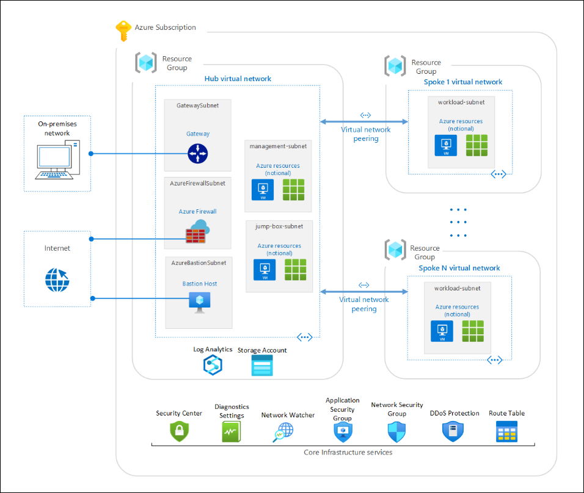

# Infrastructure and Application Security 

### Overall Estimated Duration: 8 hours

## Overview

Cloud Security in the context of Microsoft Azure infrastructure and application security involves implementing a comprehensive set of practices and tools to protect data, applications, and infrastructure hosted on the Azure platform. This includes securing virtual machines, networks, and storage through built-in security features like Azure Firewall, Network Security Groups, and encryption. Azure also provides robust identity and access management through Azure Active Directory, ensuring that only authorized users can access resources. Additionally, Azure's security tools, such as Azure Security Center and Azure Sentinel, offer continuous monitoring, threat detection, and automated response capabilities to safeguard against vulnerabilities and attacks. Adhering to these practices helps maintain a secure cloud environment, ensuring data integrity, confidentiality, and compliance with regulatory standards.

## Objective

This lab is designed to equip participants with hands-on experience to secure your application’s infrastructure with the help of Azure WAF, Application Gateways, and DDoS protection plans. Also, you’ll gain knowledge about how to 
monitor traffic and flow logs. You’ll be using multiple Azure services to secure your infrastructure.

- **Secure administration and management:** Implement robust access controls and management practices to safeguard administrative activities and ensure that only authorized users can manage Azure resources effectively.
  
- **Secure application:** Apply security best practices, such as vulnerability assessments and secure coding techniques, to protect applications deployed in Azure from potential threats and breaches.
  
- **Secure Infrastructure with Azure Firewall Premium:** Utilize Azure Firewall Premium to enforce advanced network security policies, including threat intelligence and application rules, to protect Azure infrastructure from sophisticated network attacks.
  
- **Protecting Infrastructure with Azure DDoS Protection Plans:** Deploy Azure DDoS Protection Plans to detect and mitigate distributed denial-of-service (DDoS) attacks, ensuring the availability and performance of your Azure services.
  
- **Network Management and Monitoring Revisited: Flow Logs and Traffic Analytics:** Leverage Azure Flow Logs and Traffic Analytics to gain insights into network traffic patterns, monitor potential security threats, and optimize network performance and security.

## Prerequisites

Participants should have the following prerequisites:

- **Basic Understanding of Cloud Computing:** Familiarity with fundamental cloud concepts and services, particularly in the context of Microsoft Azure.
- **Knowledge of Azure Services:** Experience with core Azure services, including Virtual Machines, Azure Storage, and Azure Networking.
- **Fundamentals of Cybersecurity:** Understanding of general cybersecurity principles, including concepts such as firewalls, encryption, and identity management.
- **Experience with Azure Portal:** Proficiency in navigating and using the Azure Portal for managing resources and configurations.
- **Networking Basics:** Knowledge of networking concepts, including IP addressing, subnets, and virtual networks, as they relate to cloud environments.
- **Familiarity with Identity and Access Management (IAM):** Understanding of IAM concepts, such as user roles, permissions, and Azure Active Directory.
- **Understanding of Security Best Practices:** Awareness of security best practices and compliance requirements specific to cloud environments.

## Architechture

Various Azure resources and services are integrated to provide a comprehensive security framework. At the core, **Azure Virtual Machines** and **Azure Virtual Networks** are protected using **Azure Firewall** and **Network Security Groups** to control and monitor traffic. **Microsoft Entra ID** (formerly know as Azure Active Directory (AAD)) manages identity and access, ensuring secure authentication and authorization. **Azure Security Center** offers unified security management and advanced threat protection across the Azure environment. **Azure Sentinel** provides intelligent security analytics and threat detection through a cloud-native SIEM (Security Information and Event Management) system. Data protection is enhanced using **Azure Key Vault** for managing secrets and **Azure Encryption** services to safeguard data at rest and in transit. Together, these resources create a layered security approach to defend against a wide range of cyber threats and ensure compliance with security policies and regulations.

## Architechture Diagram

## Explanation of Components

## Getting Started with the lab
 
Welcome to your Infrastructure Security Workshop! We've prepared a seamless environment for you to explore and learn about Azure services. Let's begin by making the most of this experience:
 
## Accessing Your Lab Environment
 
Once you're ready to dive in, your virtual machine and **Lab Guide** will be right at your fingertips within your web browser.

   

### Virtual Machine & Lab Guide
 
Your virtual machine is your workhorse throughout the workshop. The lab guide is your roadmap to success.
 
## Exploring Your Lab Resources
 
To get a better understanding of your lab resources and credentials, navigate to the **Environment Details** tab.

   
 
## Utilizing the Split Window Feature
 
For convenience, you can open the lab guide in a separate window by selecting the **Split Window** button from the Top right corner.
 
   
 
## Managing Your Virtual Machine
 
Feel free to start, stop, or restart your virtual machine as needed from the **Resources** tab. Your experience is in your hands!
 
  
 
## Let's Get Started with Azure Portal
 
1. On your virtual machine, click on the Azure Portal icon as shown below:
 
    
 
2. You'll see the **Sign into Microsoft Azure** tab. Here, enter your credentials:
 
   - **Email/Username:** <inject key="AzureAdUserEmail"></inject>
 
      
 
3. Next, provide your password:
 
   - **Password:** <inject key="AzureAdUserPassword"></inject>
 
      
 
4. If you see the pop-up **Stay Signed in?**, click **No**.

   

5. If you see the pop-up **You have free Azure Advisor recommendations!**, close the window to continue the lab.

6. If a **Welcome to Microsoft Azure** popup window appears, click **Maybe Later** to skip the tour.

## Support Contact
 
The CloudLabs support team is available 24/7, 365 days a year, via email and live chat to ensure seamless assistance at any time. We offer dedicated support channels tailored specifically for both learners and instructors, ensuring that all your needs are promptly and efficiently addressed.

Learner Support Contacts:
- Email Support: labs-support@spektrasystems.com
- Live Chat Support: https://cloudlabs.ai/labs-support

Now, click on **Next** from the lower right corner to move on to the next page.

### Happy Learning!!
