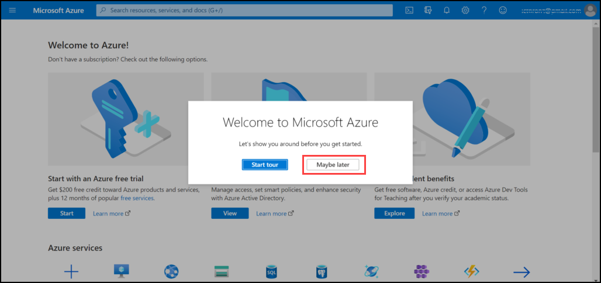
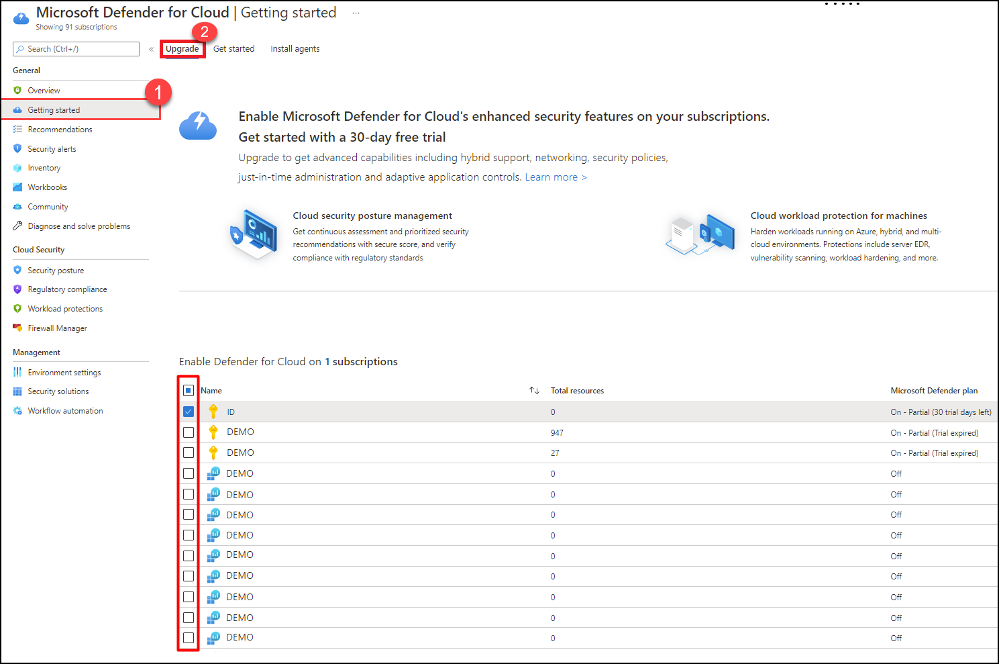
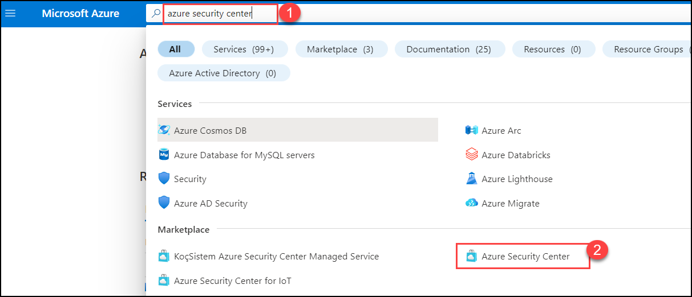
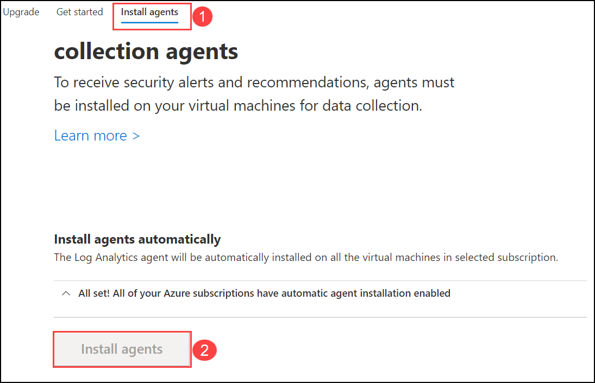

# Exercise 01: Azure Security Center/ Microsoft Defender for Cloud
## Lab objectives
In this lab, you will complete the following exercise:
1. Exploring Microsoft Defender for Cloud 
2. Configure Security Policies  
3. Secure Score 
4. Improving your Secure Posture 
5. Exploring Security Center and Security benchmark 

# Task 1: Exploring Microsoft Defender for Cloud

### What is Microsoft Defender for Cloud?

Microsoft Defender for Cloud is a Cloud Security Posture Management (CSPM) and Cloud Workload Protection Platform (CWPP) for all of your Azure, on-premises, and multicloud (Amazon AWS and Google GCP) resources. Defender for Cloud fills three vital needs as you manage the security of your resources and workloads in the cloud and on-premises:

- [**Defender for Cloud secure score**](secure-score-security-controls.md) **continually assesses** your security posture so you can track new security opportunities and precisely report on the progress of your security efforts.
- [**Defender for Cloud recommendations**](security-policy-concept.md) **secures** your workloads with step-by-step actions that protect your workloads from known security risks.
- [**Defender for Cloud alerts**](alerts-overview.md) **defends** your workloads in real-time so you can react immediately and prevent security events from developing.

Defender for Cloud secure score continually assesses your security posture so you can track new security opportunities and precisely report on the progress of your security efforts.
Defender for Cloud recommendations secures your workloads with step-by-step actions that protect your workloads from known security risks.
Defender for Cloud alerts defends your workloads in real-time so you can react immediately and prevent security events from developing.

1. In the VM, double click on the **Azure portal shortcut** on the desktop.

    
    
1. Click on the **Environment Details** tab located next to the Lab Guide tab and Copy the **Username and Password**.

    

1. Login to Azure with the username **<inject key="AzureAdUserEmail" />** and click on **Next**.

    

1. Enter password **<inject key="AzureAdUserPassword" />** and click on **Sign in**.

    
    
   > **Note:** If there's a popup entitled **Stay signed in?** with buttons for **No** and **Yes** - Choose **No**.
    
    
        
   > **Note:** If there's another popup entitled **Help us protect your account** click **Skip for now (14 days intil this is required)**

    
           
1. If **Welcome to Microsoft Azure** popup window appears, click **Maybe Later** to skip the tour.

    

1. Search **Microsoft Defender for Cloud(1)** and Select **Microsoft Defender for Cloud(2)**.

    

1. On the Defender for Cloud Page, **Click** on the **Environment settings** under Management

    
    
1. Select the **subscription or workspace** that you want to protect.
    
1. Select **Enable all** to enable all of the plans for Defender for Cloud.

    

1. Select **Save**.

## To enable enhanced security on multiple subscriptions or workspaces:

1. On the Microsoft Defender for Cloud menu, Click on **Getting started(1)** and then Select **Upgrade(2)**.
   The Upgrade tab lists subscriptions and workspaces eligible for onboarding.
    
    
        
1. Select the desired **subscriptions and workspace** from the list.

1. Select **Upgrade**.

## To Disable enhanced security on multiple subscriptions or worksapces:

1. From Defender for Cloud's menu, select **Environment settings**.

    

1. Select the relevant **subscriptions and workspaces**.

1. Find the plan you wish to turn off and select **Off**.

    

# Task 2: Configure Security Policies

## What is a security policy?

- An Azure Policy definition, created in Azure Policy, is a rule about specific security conditions that you want controlled. Built in definitions include things like controlling what type of resources can be deployed or enforcing the use of tags on all resources. You can also create your own custom policy definitions.

- To implement these policy definitions (whether built-in or custom), you'll need to assign them. You can assign any of these policies through the Azure portal, PowerShell, or Azure CLI. Policies can be disabled or enabled from Azure Policy.

- There are different types of policies in Azure Policy. Defender for Cloud mainly uses 'Audit' policies that check specific conditions and configurations then report on compliance. There are also "Enforce' policies that can be used to apply secure settings.

1. From Defender for Cloud's menu, select **Environment settings**.

    
    
1. Select the relevant **subscriptions and workspaces**.

1. On the left hand side Blade click on **Security policy** and then click on **Assign policy**.

1. On the Azure Security Benchmark page, Click on **Non-compliance messages** and then select all **Policy definations**, then click on **Review + create**.

1. Now click on **Create**.

1. Under Security policy you can also find **Industry & regulatory standards**, which can be configured with ASC default initiative.

1. Wait for couple of minutes and then refresh the browser page to see the Industry & regulatory standards enabled

## Task 3: Secure Score 

What is a Secure Score?
As you must have known by now that the azure security center has two goals :
1. It helps you understand your current security situation.
2. It helps you improve your security situation by giving recommendations.
3. A secure score is a way to achieve your goal: the higher the score, the lower the risk level.

To improve the percentage, review Security center recommendations for the pending actions. Proposals also include steps to follow to achieve the goal.

Secure Score
How is the Secure Score Calculated?
Each recommendation has some points assigned to it. If you apply that recommendation, the score will automatically increase. Each proposal will have a maximum score and current score, as shown in the figure.

Score Calculation 
Few formulas are used by azure to calculate the score, which you as a user don’t need to worry about. You need to follow the security recommendations provided by the Azure Security Center.
Overview of secure score
Microsoft Defender for Cloud has two main goals:

To help you understand your current security situation
To help you efficiently and effectively improve your security
The central feature in Defender for Cloud that enables you to achieve those goals is the secure score.

Defender for Cloud continually assesses your cross-cloud resources for security issues. It then aggregates all the findings into a single score so that you can tell, at a glance, your current security situation: the higher the score, the lower the identified risk level.

In the Azure portal pages, the secure score is shown as a percentage value and the underlying values are also clearly presented:

Overview of secure score
Microsoft Defender for Cloud has two main goals:

to help you understand your current security situation
to help you efficiently and effectively improve your security
The central feature in Defender for Cloud that enables you to achieve those goals is the secure score.

Defender for Cloud continually assesses your cross-cloud resources for security issues. It then aggregates all the findings into a single score so that you can tell, at a glance, your current security situation: the higher the score, the lower the identified risk level.

In the Azure portal pages, the secure score is shown as a percentage value and the underlying values are also clearly presented:

## Access and track your secure score
You can find your overall secure score, as well as your score per subscription, through the Azure portal or programmatically as described in the following sections:
Get your secure score from the portal
Defender for Cloud displays your score prominently in the portal: it's the first main tile the Defender for Cloud overview page. Selecting this tile, takes you to the dedicated secure score page, where you'll see the score broken down by subscription. Select a single subscription to see the detailed list of prioritized recommendations and the potential impact that remediating them will have on the subscription's score.

1. Search **Microsoft Defender for Cloud(1)** and Select **Microsoft Defender for Cloud(2)**.

1. Now on Microsoft Defender for Cloud overview page you can see your secure score.

1. Click on **secure posture**.

1. Here you can get an overview of your security secure, unhealthy resources, and recomdations.

## Task 4: Improving your Secure Posture 

## How your secure score is calculated

The contribution of each security control towards the overall secure score is shown on the recommendations page.

To get all the possible points for a security control, all of your resources must comply with all of the security recommendations within the security control. For example, Defender for Cloud has multiple recommendations regarding how to secure your management ports. You'll need to remediate them all to make a difference to your secure score. ((((((((((((((recomdations))))))))))))))))))))))))))

## Task 5: Exploring Security Center and Security benchmark

Azure Security Center by Microsoft is a solution that provides unified security management across hybrid cloud workloads. It offers threat protection for data centers within both cloud workloads and on-premises.

1. In the Azure portal, Search **Azure Security Center (1)** and then click **Azure Security Center (2)**. 

     
     
1. On the Security Center | Getting started blade, click **Install agents (1)** and then click **Install agents (2)**.

     

1. On the Security Center | Overview blade, review the Secure Score tile.

> **Note:**: Record the current score if it is available.

1. Navigate back to the Security Center | Overview blade, select **Assessed resources**.

1. On the **Inventory blade**, select the **myVM entry**.

