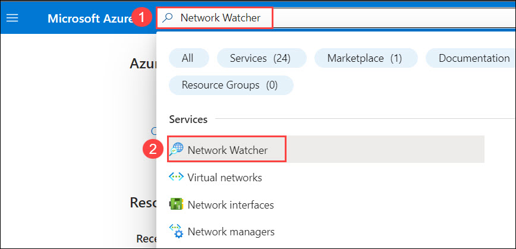
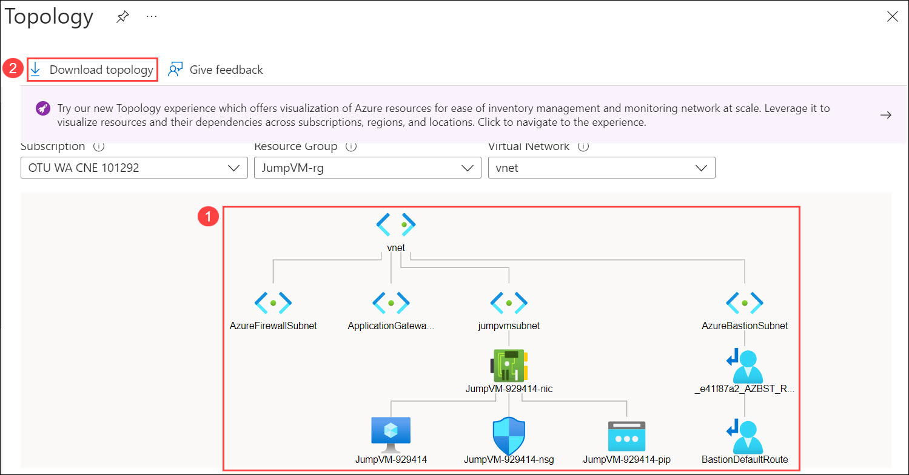

# Exercise 1- Secure administration and management

## Task 1: Network Health - New 

## Task 2: Network Topology - New 

The topology capability of Azure Network Watcher enables you to view all of the resources in a virtual network, the resources associated to resources in a virtual network, and the relationships between the resources. In this task, you'll view resources in a Microsoft Azure virtual network, and the relationships between the resources.

1. Navigate to Azure portal. Using the search bar, search for **Network Watcher (1)** and **select (2)** it from the suggestion

   

1. From the sidebar, select **Topology** from monitoring.

   

1. Select the **default subscription (1)**, **JumpVM-RG (2)** for Resource group, and **vnet (3)** for virtual network in the Toplogy tab.  

   

1. Now, you'll be able to **visualize (1)** the Virtual network topology and understand how different network resources such as virtual machines, subnets, virtual network gateways, and other network components are interconnected and how they communicate with each other. You can also the download the toplogy by clicking on **Download topology (2)**.

   

## Task 3: Secure Access via Bastion Host - New 

## Task 4: Prepare the Network Watcher monitoring environment and NSG Flow – New 

 