# Exercise 1- Secure administration and management

## **Task 1: Network Health**

Azure Monitor Network Insights provides a comprehensive and visual representation through topologies of the health and metrics of all deployed network resources without requiring any configuration. It also provides access to network monitoring capabilities like Connection Monitor, flow logging for network security groups (NSGs), and traffic analytics.

1. Navigate to the Azure portal. Using the search bar, search for **Monitor (1)** and **select (2)** from the suggestions.

   

1. From the sidebar, select **Networks** from Insights.

   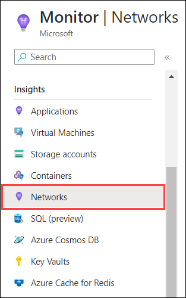
   
1. On the **Network health** tab, you can customize the resource health and alerts view by using filters like **Subscription**, **Resource Group**, and **Type**, and you can use the search box to search for resources and their associated resources. For example, a public IP is associated with an application gateway. A search for the public IP's DNS name will return both the public IP and the associated application gateway.

   

1. In this, each tile represents a resource type. The tile displays the number of instances of that resource type deployed across all selected subscriptions. It also displays the health status of the resource.

   

1. You can click on any resource to select the resource view, The resource view helps you visualize how a resource is configured. The resource view is currently available for **Azure Application Gateway**, **Azure Virtual Network**, and **Route table**. For example, for Application Gateway, you can access the resource view by selecting the Application Gateway resource name in the metrics grid view. You can do the same thing for Azure Virtual Network, and route table.

   

1. Click on the **Throughput** icon next to the location to bring up the Metrics.
   
    
     
1. You will see the **Metrics** as given below:

    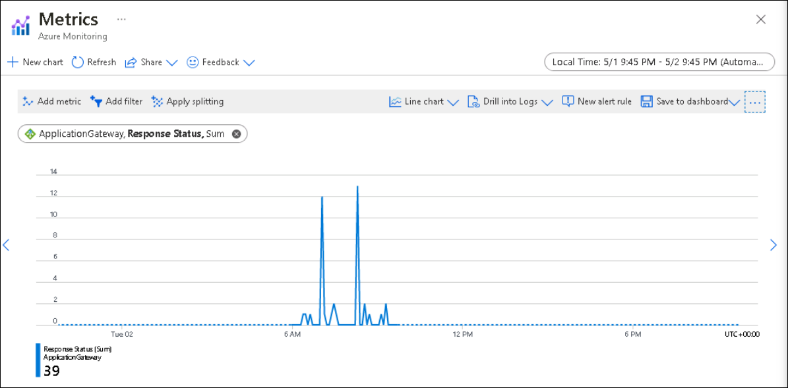

## **Task 2: Network Topology** 

The topology capability of Azure Network Watcher enables you to view all of the resources in a virtual network, the resources associated with the resources in a virtual network and the relationships between the resources. In this task, you'll view resources in a Microsoft Azure virtual network, and the relationships between the resources.

1. Navigate to the Azure portal. Using the search bar, search for **Network Watcher (1)** and **select (2)** from the suggestions.

   

1. From the sidebar, select **Topology** from Monitoring.

   

1. Select the **default subscription (1)**, **JumpVM-RG (2)** for Resource group, and **vnet (3)** for virtual network in the Topology tab.  

   

1. Now, you'll be able to **visualize (1)** the Virtual network topology and understand how different network resources such as virtual machines, subnets, virtual network gateways, and other network components are interconnected and how they communicate with each other. You can also download the topology by clicking on **Download topology (2)**.

   

## **Task 3: Secure Access via Bastion Host**

In this task, we are demonstrating how you can connect to VMs in an environment without configuring a public IP on the VMs.

1. Navigate to the Azure portal. Using the search bar, search for **Virtual networks (1)** and **select (2)** from the suggestions.

   

1. Select the **vnet** from the list.

   

1. From the sidebar, select **Subnets** from Settings.
   
   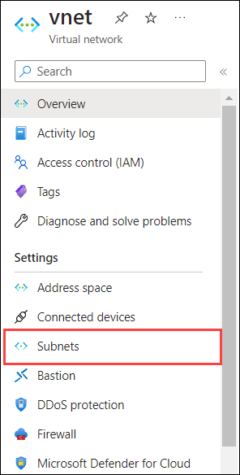

1. You will see that **AzureBastionSubnet** is already present in the subnets, if you want to see the subnet configuration, then you can click on the AzureBastionSubnet subnet and explore on this.

   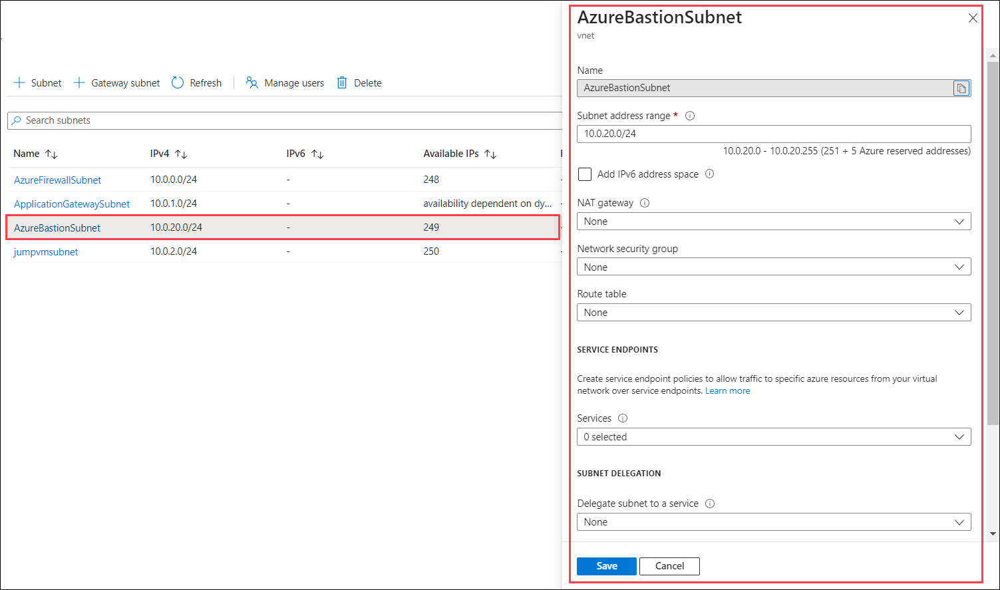

1. Now Using the search bar, search for **Virtual machines (1)** and **select (2)** from the suggestions.

   

1. Select the **JumpVM-<inject key="DeploymentID" enableCopy="false" />** from the list.

   

1. On the Virtual Machine page, go to the **Overview (1)** tab and click on **Connect (2)** then click ** Use Bastion (3)**.
 
    
 
1. On the Bastion page, follow the below-mentioned instructions to connect to the Virtual Machine using Bastion:
 
    - **Username**: Enter **the jumpVM Admin Username from the email you received when registering (1)**
    - **Authentication Type**: Select **Password (2)** from the drop-down
    - **Password**: Enter **Enter the jumpVM Admin Password from the email you received when registering (3)**
    - Click on **Connect (4)**
 
      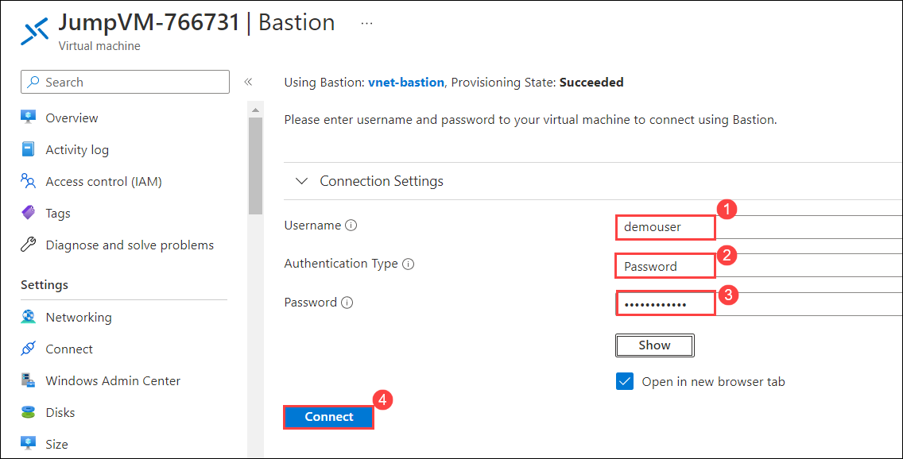
 
1. Now, you will be redirected to a new tab where the Bastion VM is opened. If you see the pop-up **See text and images copied to the clipboard**, click on **Allow**.
 
    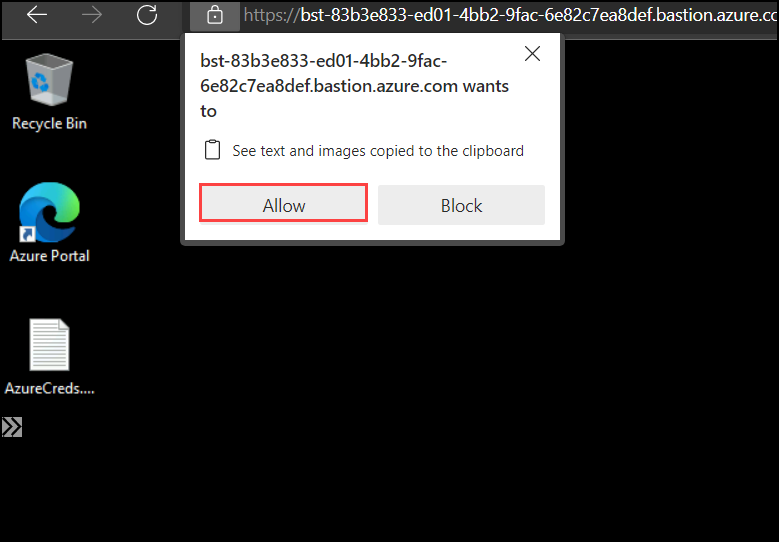

## **Task 4: Prepare the Network Watcher monitoring environment and NSG Flow**

Network Watcher provides several features to monitor and diagnose network performance issues. We will create NSG flow logs that will provide detailed information about the network traffic that passes through your NSG. They capture information such as source and destination IP addresses, source and destination ports, protocol, and action taken (allow or deny) by the NSG. This information can be used for troubleshooting network connectivity issues, monitoring and analyzing network traffic patterns, and detecting potential security threats.

1. Navigate to the Azure portal. Using the search bar, search for **Resource group (1)** and **select (2)** from the suggestions.

   

1. Select the **JumpVM-rg** from the list.

   

1. From the list of resources, select the Network Security Group named **JumpVM-<inject key="DeploymentID" enableCopy="false" />-nsg**.

   

1. In the sidebar, select **NSG flow logs** from the Monitoring menu.

   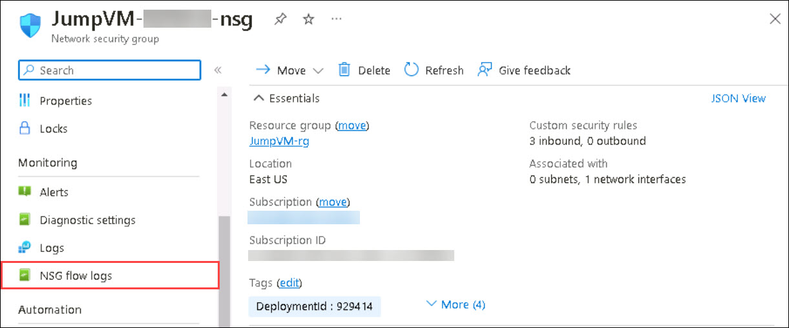

1. Click on the **create** button.

   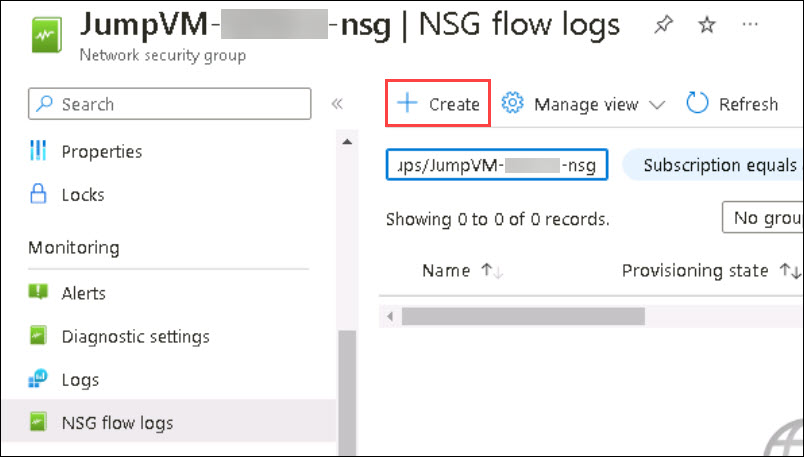

1. In the Create a flow log page, select the **default subscription (1)** in the drop-down and click on **Select resource (2)**.

   

1. In the Select network security group page, select **JumpVM-<inject key="DeploymentID" enableCopy="false" />-nsg** **(1)** and click on **Confirm selection (2)**.

   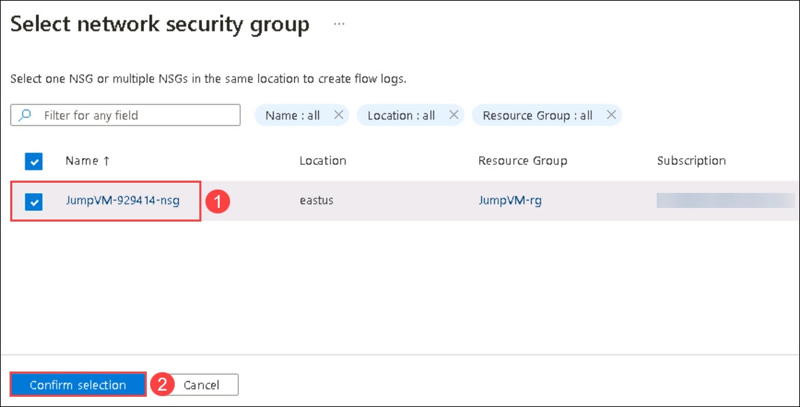

1. For the Instance details, Provide the following details and click on **Next: Analytics > (4)**

   - **Subscription**: select **default subscription (1)** from the drop-down.
   - **Storage account**: select **nsglogs<inject key="DeploymentID" enableCopy="false" />** from the drop down.
   - **Retention (days)**: **30 (3)**

      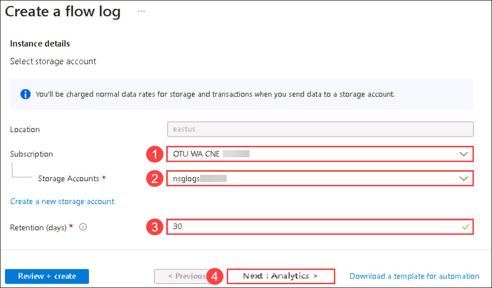  
   
1. Under the **Analytics** tab, check the box to **Enable Traffic Analytics (1)** and select **Review + Create (2)**.

   

1. In the Create page, click on the **Create** button, and wait till the deployment completion.

   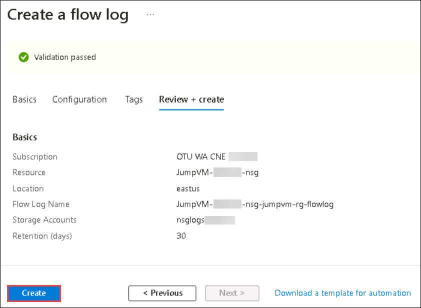  

1. Navigate to the Azure portal. Using the search bar, search for **Resource group (1)** and **select (2)** from the suggestions.

   

1. Select the **JumpVM-rg** from the list.

   

1. From the list of resources, select the Network Security Group named **JumpVM-<inject key="DeploymentID" enableCopy="false" />-nsg**.

   

1. From the sidebar, select **Diagnostic settings (1)** and click on **+ Add diagnostic setting (2)**.

   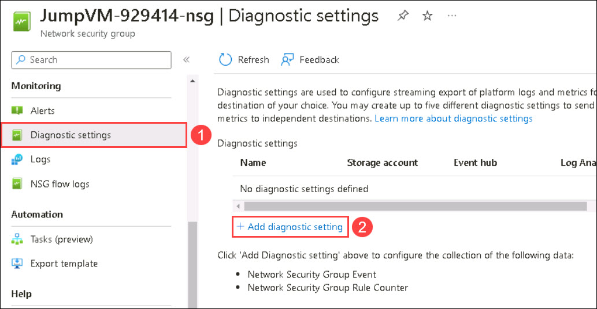

1. In the Diagnostic settings page, provide the following details and click on **Save (6)**.

   - **Diagnostic setting name**: **NSG_Flow_Logs (1)**
   - **Logs> Category groups**: check the **allLogs (2)** checkbox.
   - **Destination details**: select the **Archive to a storage account (3)** checkbox. Make sure the **default subscription (4)** is selected for subscription and **nsglogs<inject key="DeploymentID" enableCopy="false" /> (5)** for storage account.

      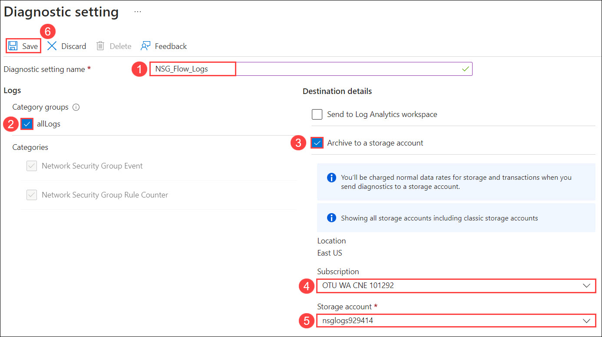
