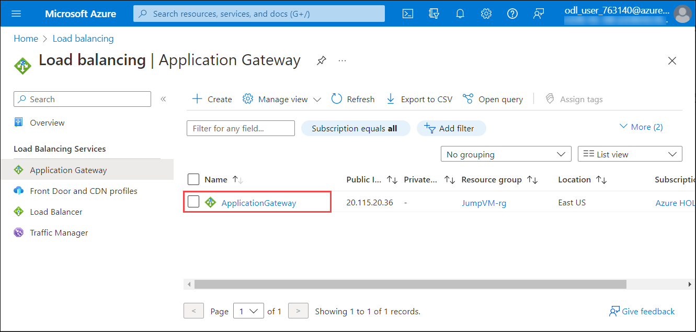
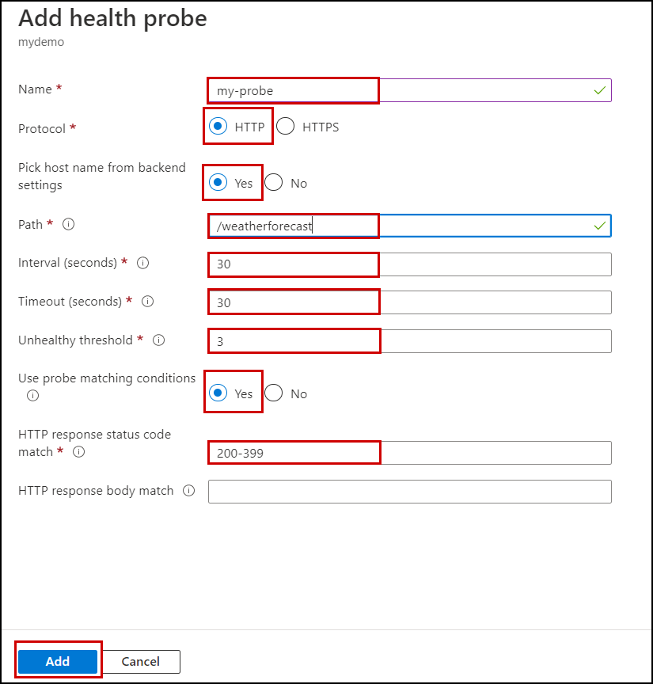
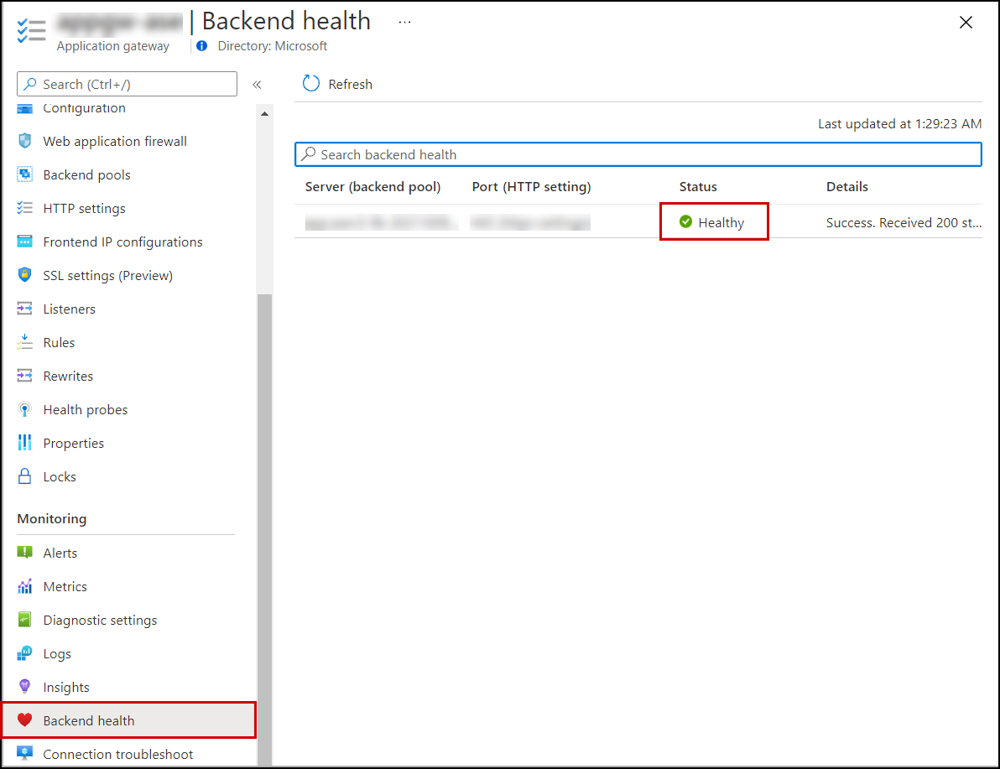

# Exercise 2: Azure Web Application Firewall on Application Gateway
## Lab objectives
In this lab, you will complete the following exercise:

1. Configure WAF to Protect your web application
2. Publish your application to the internet with the application gateway
3. Monitor attacks against your web application
4. Customize WAF rules
5. Attack simulation

# Task 1: Configure WAF to Protect your web application

### What is Azure Web Application Firewall ?
Microsoft Azure also has a WAF service that provides centralized protection of your web applications from common exploits and vulnerabilities. The Azure Web Application Firewall is one of the features of Azure Application Gateway (layer 7 load balancer) and its main goal is to protect a web application to common attack like SQL injections, cross-site scripting and others. Also it is following the Open Web Application Security Project (OWASP) Core Rule Set. Azure WAF service offers you to select some or all of the rules from the OWASP Core Rule Set.

Azure Application Gateway has a public IP, or front end, and your application users will use this IP address to connect to your application gateway. Application Gateway is going to take the incoming traffic and, based on a few rules, redirect the traffic to the appropriate back end in the backend pool. You can have app services, virtual machines, virtual machine scale sets, or even other IP addresses in the backend pools.

 
 
 ## Task 1: Configure WAF to Protect your web application
 
 1. Search **Application Gateway (1)** and then select **Application Gateway(2)**.
 
      
    
 1. Select your **Application Gateway**.

      
      
 1. On the Application gateway blade click on **Health Probes(1)** setting and then click on **Add(2)**.

      
      
 1. - Enter Name of the probe : **my-probe**
    - Keep Protocol as **HTTP**.
    - Choose Pick host name from backend HTTP settings as **YES**.
    - Enter the relative **Path** of the probe.
    - Enter the **Interval (seconds)** : 30
    - Enter the **Timeout (seconds)**  : 30
    - Enter the **Unhealthy threshold** : 3
    - Choose Use probe matching conditions as **YES**.
    - Enter the value of HTTP response status code match: **200-399**.
    - Click on **Add**.
 
      
  
 1. On the Application gateway blade Click on **Backend setting(1)** and then select your **Backend setting(2)**.

      
      
 1. - Choose override with new host name as **YES**.
    - Select Host name Override : **Pick host name from Backend target**.
    - Choose Use Custom probe as **YES**.
    - Select your Custom probe as **my-probe**.
    - Click on **Save**.
 
      
      
 1. Now, On the Application gateway blade click on **Backend health** setting and check that status is **Healthy**.
 
      
      
 
 # Task 2: Publish your application to the internet with the application gateway
 

  

      
