# Exercise 2- Secure application  

### Overview

Azure Firewall is a managed, cloud-based network security service that protects your Azure Virtual Network resources. It's a fully stateful firewall as a service with built-in high availability and unrestricted cloud scalability. To learn more about Azure Firewall refer: `https://docs.microsoft.com/en-us/azure/firewall`

Azure Application Gateway is a web traffic load balancer that enables you to manage traffic to your web applications. Traditional load balancers operate at the transport layer (OSI layer 4 - TCP and UDP). To learn more about Application gateway refer: `https://docs.microsoft.com/en-us/azure/application-gateway`

Azure Web Application Firewall provides centralized protection of your web applications from common exploits and vulnerabilities. Web applications are increasingly targeted by malicious attacks that exploit commonly known vulnerabilities. SQL injection and cross-site scripting are among the most common attacks. Preventing such attacks in application code is challenging. It can require rigorous maintenance, patching, and monitoring at multiple layers of the application topology. A centralized web application firewall helps make security management much simpler. To learn more about Azure Web Application Firewall refer: `https://docs.microsoft.com/en-us/azure/application-gateway`

In this exercise, you will deploy an Azure Firewall and Application Gateway with WAF V2 then you will publish an application through it. You'll also test the security of the application and perform a sample attack.

This exercise includes the following tasks:

  - Configure WAF to protect your web application
  - Publish your application to the internet with the application gateway
  - Application Gateway WAF Custom Rule to block IP
  - Attack simulation
  - Rate Limiting using Azure Front Door

 ## **Task 1: Configure WAF to protect your web application**
 
 In this task, you will add Virtual Machine as the Backend pool of the Application gateway and also configure the Application Gateway from the firewall policy.
 
 1. From the Azure **Home** page, search for **Application gateways (1)** from the search bar and select **Application gateways (2)**.
 
      
    
 1. Select your **Application Gateway**.

      
      
 1. On the Application gateway blade click on the **Backend pools(1)** under setting and then select **AGBackendtarget(2)**.

     
     
 1. On the **Edit backend pool** page, follow the below-mentioned instructions:

    - **Target type**: Select **Virtual Machine (1)** from the drop-down.
    - **Target**: Select **JumpVM-<inject key="Deployment ID" enableCopy="false"/>-nic (2)** from drop-down.
    - Click on **Save (3)**.

      
    
1. Once the Backend pools are edited, you will see the notification that says **Successfully added rule collection**, as shown below.

     

 1. Navigate back to the home page and search for **Application Firewall Policies (1)** from the search bar and select **Web Application Firewall Policies (2)**.

      
 
 1. Click on **firewallpolicy** under the Web Application Firewall page and click on **Associated application gateways** under the **Settings** tab from the Application Gateway WAF policy page.

     
     
 1. On the **Associated Application gateway** page, click on **+ Add association (1)** and select **Application Gateway(2)**

    
    
 1. Under the **Associate an application gateway** page, follow the below instructions:

    - **Application Gateway (WAF v2 SKU)**: Select **Application Gateway (1)** from the drop down. 
    - **Check** the box next to **Apply the web Application Firewall policy configuration even if it's different from the current configuration (2)**.
    - Click on **Add (3)**.

      
    
 ## **Task 2: Publish your application to the internet with the application gateway**
 
In this task, you'll publish an application via Application Gateway by configuring the DNAT rules from the firewall policy.

1.  In the Azure **Home** page, from the search bar search for **Application gateways (1)** and then select **Application gateways (2)**.
 
     
 
1. Select your **Application Gateway**.
 
     
 
1. Select the **Frontend public IP address** of the application gateway.
 
      

1.  Copy the **Public Ip address** and save it to notepad for later use.

     
    
1. On the Azure Portal **Home** page, search **Azure Firewall (1)** and then select **Firewalls (2)**.

   
    
1. Click on the **AzureFirewall**.

   
   
1. Select **Firewall Public IP** from the Overview tab.

    
    
1. Copy the **Public Ip address** and save it to notepad for later use.

      
     
1. Navigate back on Azure Firewall, Select **Firewall Manager (1)** from the **Settings** tab, and click on **Visit Azure Firewall Manager to configure and manage this firewall (2)**

   
    
1. Select **Azure Firewall Policies (1)** under the **Firewall Manager** page and click on Firewall Policy **firewallpolicy (2)**.

   
   
1. Select **DNAT Rules (1)** from the **Settings** tab under the **Firewall Policy** page and select **+ Add a rule collection (2)**

   
    
1. Under the **Add a rule collection** page, enter the below details:

    - Name: **afw-contoso-prod-firewall-rulecolection (1)**
    - Rule Collection type: **DNAT (2)**
    - Priority: **100 (3)**
    - Rule collection group: **DefaultDnatRuleCollectionGroup (4)**
    - Under **Rules (5)** mention the below details:
      - Name: **afw-dnat-http**
      - Source type: Select **IP Address** from the drop-down list
      - Source: Enter *
      - Protocol: Select **TCP** from the drop-down list
      - Destination Ports: **80**
      - Destination type: Select **IP Address** from the drop-down list
      - Destination: Enter the IP address of the **Firewall** which you copied in step 8.
      - Translated address: Enter the Public IP address of the **Application gateway** which you copied in step 4.
      - Translated port: **80**
     
     - Click on **Add (6)**.

       
          
1. Now, to test the application copy and paste the Frontend public IP address of **Application Gateway** into a new browser tab that you copied in step 4.

   
       
   > **Note: This will confirm that you have published the Contoso web application via Application Gateway**.


 ## **Task 3: Application Gateway WAF Custom Rule to block IP**
 
  In this task, you will login into the Jump VM to configure the Custom rules for firewall policy and will publish the web application within the VM and from the Lab VM to check the application's reachability.
 
1. In the Azure portal, search for **Virtual Machines (1)** and select it from the results **(2)**.

   
     
1. On Virtual machines page, select **JumpVM-<inject key="DeploymentID" enableCopy="false" />**.

   

1. Click on **Connect (1)** and then select **RDP (2)**.

   
     
1. Under **RDP** tab, click on **Download RDP file**.

   
     
1. Open the downloaded RDP file and click on **Connect**.

   
   
1. Enter the below given credentials and click on **Ok (3)**

   - User name: Enter **.\demouser (1)**
   - Password: Enter **<inject key="JumpVM Admin Password" enableCopy="true" /> (2)**
 
   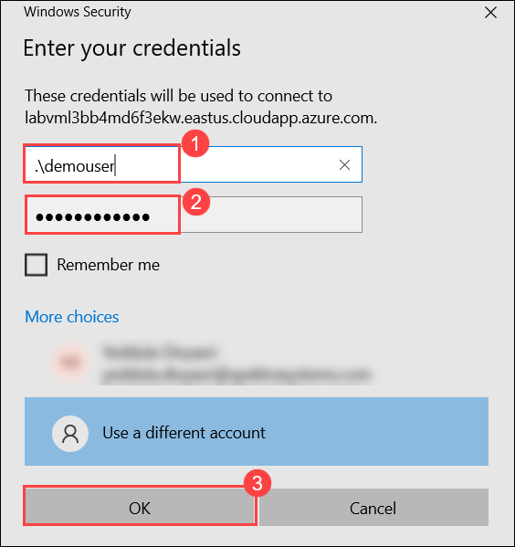
    
1. Click on the **Yes** button to accept the certificate and add in trusted certificates.

   
    
1. Within the **Jump VM**, type **cmd (1)** in the search bar and right-click on **Command Prompt (2)** then click on **Run as administrator (3)**.
 
   
 
 1. On the Command Prompt, type **ipconfig (1)** and then copy the **IPv4 Address (2)** and save it to notepad for later use.
 
    
 
 1. Now, navigate back to the **Lab VM**, search **WAF (1)** from the Azure Portal and then select **Web Application Firewall policies (WAF) (2)**.
 
    
 
 1. On the WAF page, select your **firewallpolicy (1)**, and under settings, click on **Custom rules (2)** and after that click on **+ Add custom rule (3)**.
 
    
 
 1. On the **Add custom rule** blade, enter the following details
 
    - Custom rule name: **WAFcustomrule (1)**
    - Priority: Enter **1 (2)**.
    - IP address or range: Enter **IPv4 Address (3)** that is copied above in step 2.
    - Click on **Add (4)**.
 
      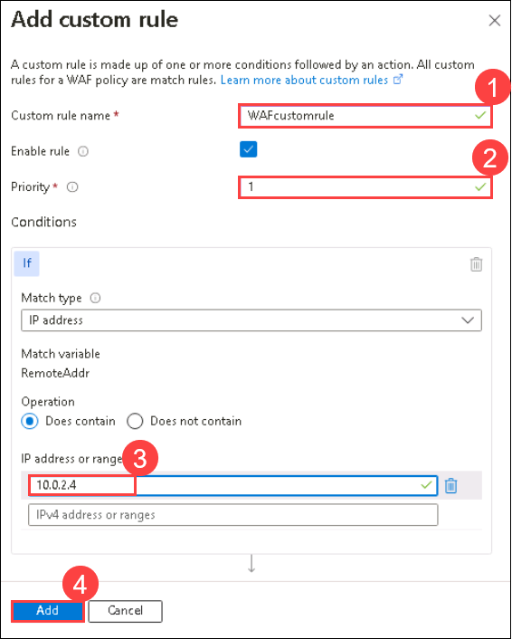
 
1. Click on **Save**.
 
   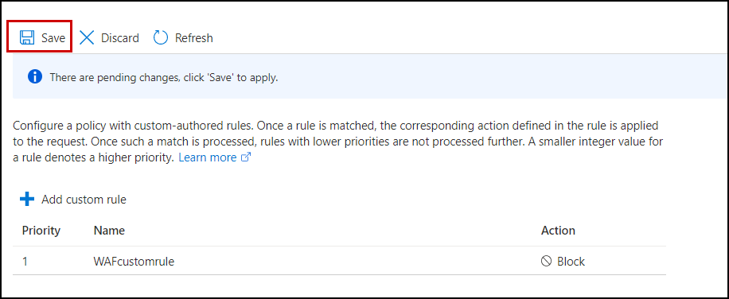

1. Once the custom rule is created you will see the notification that says **Successfully updated the WAF policy**, as shown below.
 
   
 
1. Now, navigate back to **JumpVM-<inject key="Deployment ID" enableCopy="false"/>** which you accessed using RDP and open the **Browser** from desktop

   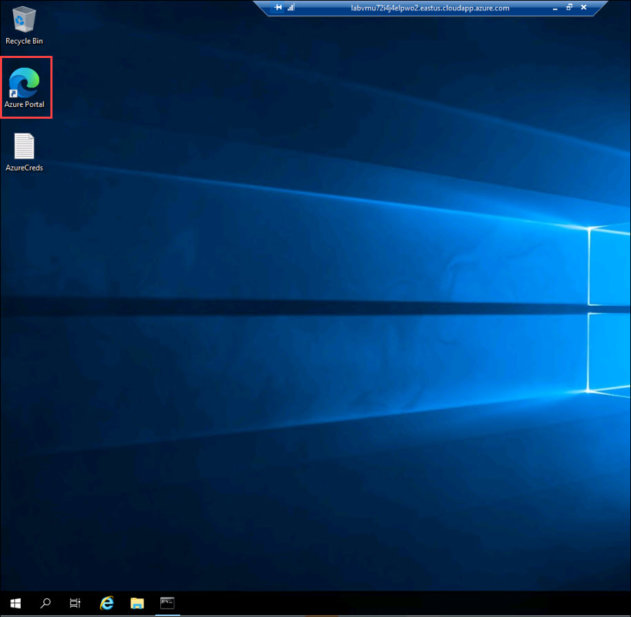
 
1. Open a new tab and browse the **IPv4 Address** for which you created the custom rule. you will see that your website is accessible.

   

1. Close the RDP session, try accessing the **IPv4 Address** using a browser tab in **Lab VM**. You will observe that the IP address is not accessible and **This site can’t be reached** error shows up.
 
   

 ## **Task 4: Attack simulation** 
     
In this task, you will be testing your application for security and performing sample attacks like XSS. Cross-Site Scripting (XSS) attacks are a type of injection, in which malicious scripts are injected into otherwise benign and trusted websites. XSS attacks occur when an attacker uses a web application to send malicious code, generally in the form of a browser-side script, to a different end-user.

   > **Note**: You can perform this task only after finishing task 2 and task 3.

You can perform a sample attack on your application by passing this `?q=<script>` value at the end of the web application URL or IP address.
    
1. Now pass the value `?q=<script>` at the end of your **Application Gateway** IP and try browsing it using browser. You can observe that the web application is accessible.
  
   >**Note**: Your browsing URL value should look like ```http://20.185.224.102/?q=<script>```
    
   
  
1. To make your application more secure, select **ApplicationGateway** from the overview page of the resource group.
     
   
    
1. Under the **Application gateway** page, follow the below details:
     - Select **Web application firewall (1)** under **Settings**.    
     - Click on **firewallpolicy** under **Associated web application firewall policy (2)**.  
  
         
 
1. Under the **firewallpolicy** page, go to the **Overview (1)** tab and click on **Switch to prevention mode (2)**.
 
    
    
1. Now, navigate back to the tab where you browsed the IP Address and refresh the page. You can observe the **403 Forbidden error**.
    
    

## **Task 5: Rate Limiting using Azure Front Door**
  
In this task, you will set up an Azure Front Door configuration that pools two instances of a web application that runs in different Azure regions. This configuration directs traffic to the nearest site that runs the application. Azure Front Door continuously monitors the web application. You will demonstrate automatic failover to the next available site when the nearest site is unavailable. The network configuration is shown in the following diagram:  
  

  
### **Task 5.1: Create two instances of a web app**
 
This task requires two instances of a web application that run in different Azure regions. Both the web application instances run in Active/Active mode, so either one can take traffic. This configuration differs from an Active/Stand-By configuration, where one acts as a failover.
  
1. On the Azure home page, using the global search enter **WebApp (1)** and select **App Services (2)** under services.
  
   

1. Select **+ Create** to create a Web App.
  
   

1. On the Create Web App page, on the **Basics** tab, enter or select the following information.

   | **Setting**      | **Value**                                                    |
   | ---------------- | ------------------------------------------------------------ |
   | Subscription     | Select the **default subscription (1)**.                                    |
   | Resource group   | Select the resource group **JumpVM-rg (2)**                  |
   | Name             | Enter **OWASP-MainJump<inject key="Deployment ID" enableCopy="false"/> (3)**                                         |
   | Publish          | Select **Docker Container (4)**.                             |
   | Operating System | Select **Linux (5)**.                                        |
   | Region           | Select **EastUS (6)**.   
   | pricing plan | Select **Basic B1 (100 total ACU, 1.75 GB memory, 1 vCPU) (7)**.                                        |
 
  
   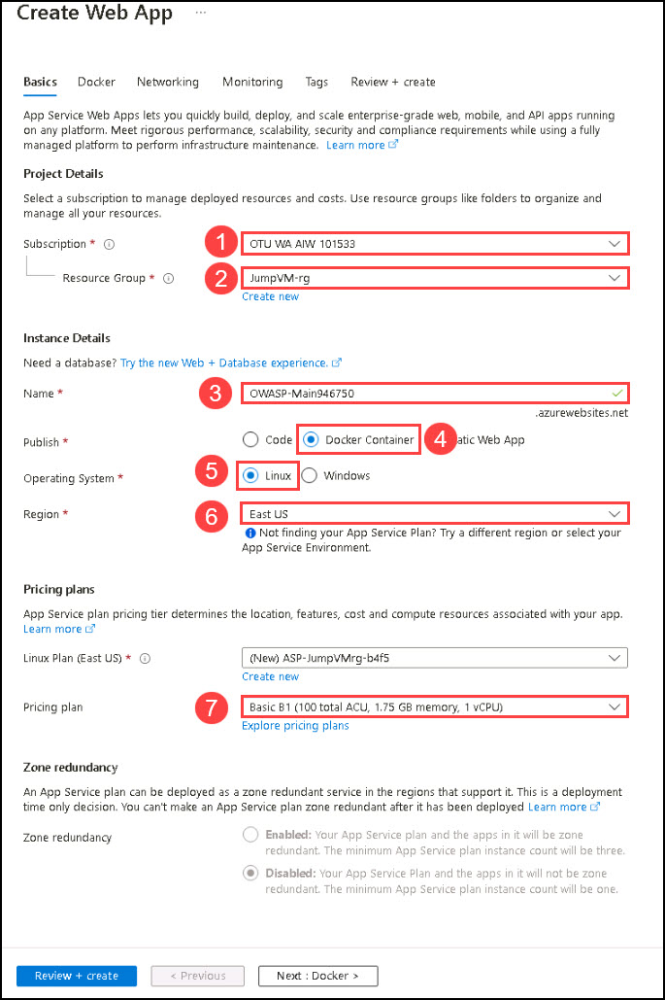
  
1. Click on **Next : Docker >**.
  
1. On the **Docker** tab, enter or select the following information.
  
   | **Setting**      | **Value**                                                    |
   | ---------------- | ------------------------------------------------------------ |
   | Options           | Select **Single Container (1)**                              |
   | Image Source     | Select **Docker Hub (2)**                                    |
   | Access Type      | Select **Public (3)**                                        |
   | Image and Tag    | Enter **bkimminich/juice-shop:latest (4)**                   |
    
  
   
  
1. Select **Review + create**, review the Summary, and then select **Create**. It might take several minutes for the deployment to complete.
  
   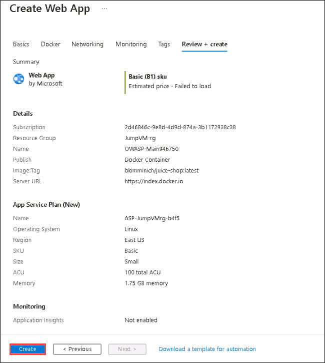
  
1. Let us create a Second web app. Using the search box on the Azure home page, enter **WebApp (1)** and select **App Services (2)** under services.
  
   
  
1. Select **+ Create** to create a Web App.
  
   

1. On the Create Web App page, on the **Basics** tab, enter or select the following information.

   | **Setting**      | **Value**                                                    |
   | ---------------- | ------------------------------------------------------------ |
   | Subscription     | Select the **default subscription (1)**.                                    |
   | Resource group   | Select the resource group **JumpVM-rg (2)**                  |
   | Name             | Enter **OWASP-Stage<inject key="Deployment ID" enableCopy="false"/> (3)**                                         |
   | Publish          | Select **Docker Container (4)**.                             |
   | Operating System | Select **Linux (5)**.                                        |
   | Region           | Select **EastUS 2 (6)**.   
   | pricing plan      | Select **Basic B1 (100 total ACU, 1.75 GB memory, 1 vCPU) (7)**.  |

   
  
1. Click on **Next : Docker >**.
  
1. On the **Docker** tab, enter or select the following information.
  
   | **Setting**      | **Value**                                                    |
   | ---------------- | ------------------------------------------------------------ |
   | Options           | Select **Single Container (1)**                              |
   | Image Source     | Select **Docker Hub (2)**                                    |
   | Access Type      | Select **Public (3)**                                        |
   | Image and Tag    | Enter **bkimminich/juice-shop:latest (4)**                   |
    
  
   
  
1. Select **Review + create**, review the Summary, and then select **Create**. It might take several minutes for the deployment to complete.
  
   

### **Task 5.2: Create a Front Door for your application**

Configure Azure Front Door to direct user traffic based on the lowest latency between the two Web App's origins. You'll also secure your Azure Front Door with a Web Application Firewall (WAF) policy.
  
1. In the Azure portal, search for **Front Door and CDN profiles (1)** and select it from the results **(2)**.
  
    
  
1. Select **+ Create** to create a Front Door and CDN profile.
  
    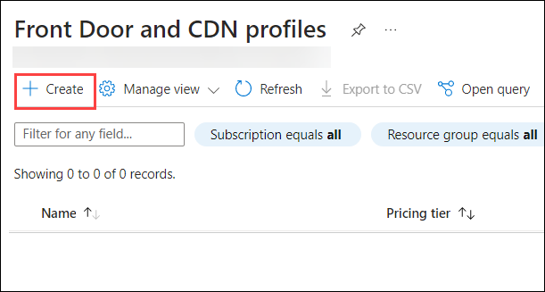

1. On the **Compare offerings** page, select **Custom create**. Then select **Continue to create a Front Door**.
  
    
  
1. On the **Basics** tab, enter or select the following information, and then select **Next: Secret (5)**.
  
   | **Setting**                 | **Value**                                                     |
   | ----------------------------| ------------------------------------------------------------  |
   | Subscription                | Select your subscription (1).                                     |
   | Resource group              | Select the resource group **JumpVM-rg (2)**                       |
   | Resource group location     | Default same as resource group                                |
   | Name                        | Enter **Webapp-Contoso-AFD (3)**                                  |
   | Tier                        | Select **Standard (4)**                                            |
 
  
    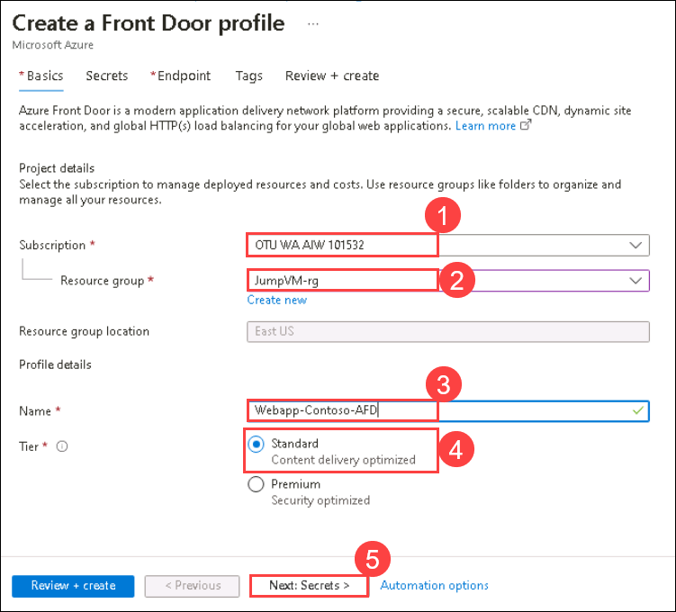
  
1. On the **Secrets**, Leave it default as same and click on **Next: Endpoint >**.
  
    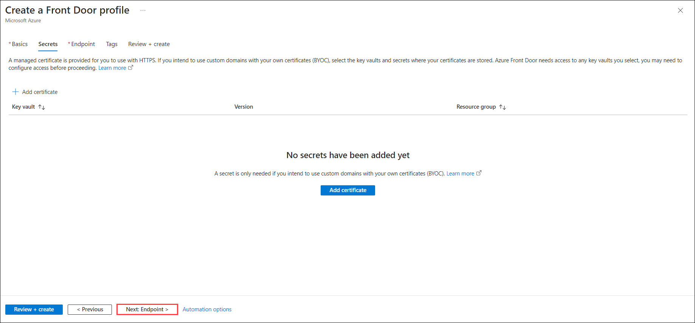
  
1. In the **Endpoint** tab, select **Add an endpoint (1)** and give your endpoint name as **contoso-frontend (2)**. Select **Add** to add the endpoint.
  
    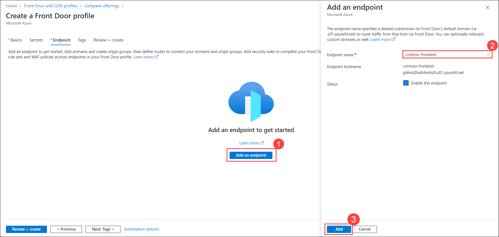
  
1. Next, select **+ Add a route** to configure routing to your Web App origin.
  
    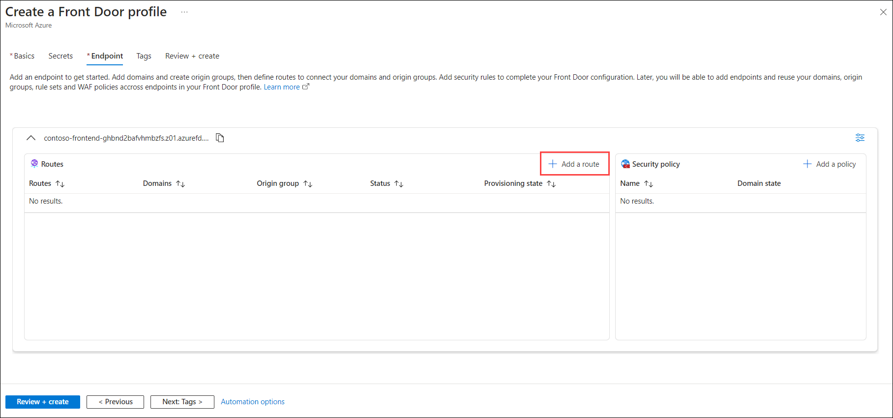
  
1. On the **Add a route** page, enter name as **myRoute (1)** and click on **Add an origin group (2)**.
  
    
  
1. On the **Add an origin group** pane, enter name as **myOriginGroup (1)** and click on **+ Add an origin (2)**.
  
   
  
1. To add the first origin, enter **OWASP-Main (1)** as the name, **App services (2)** as the origin type, and select **owasp-mainjump<inject key="DeploymentID" enableCopy="false" />.azurewebsites.net (3)** as the host name then click **Add (4)**.
  
   

1. To add the Second origin, enter **OWASP-Stage (1)** as the name, **App services (2)** as the origin type, and select **owasp-stage<inject key="DeploymentID" enableCopy="false" />.azurewebsites.net (3)** as the host name then click **Add (4)**.
  
   
  
1. Click on **Add**.
  
   
  
1. Again select **Add** to add a route.
  
   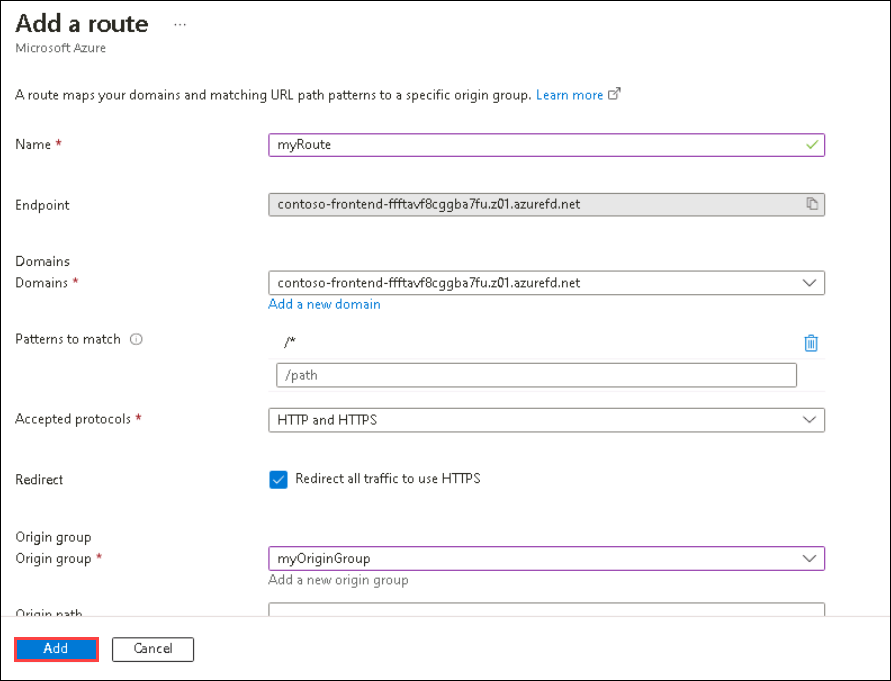
  
1. Select **+ Add a policy** to apply a Web Application Firewall (WAF) policy to one or more domains in the Azure Front Door profile.
  
   
  
1. On the **Add security policy** page, enter a name **mySecurityPolicy (1)**. Then select domains you want to associate the policy with. For WAF Policy, select **Create New** to create a new policy. Enter name of policy is **myWAFPolicy (2)**. Select **Save (3)** to add the security policy to the endpoint configuration.
  
   
  
1. Select **Review + Create**, review the Summary, and then select **Create** to deploy the Azure Front Door profile. It will take a few minutes for configurations to be propagated to all edge locations.
  
   
    
   
  
### **Task 5.3: View Azure Front Door in action**
  
Once you create a Front Door, it takes a few minutes for the configuration to be deployed globally. Once complete, access the frontend host you created.
  
1. On the Front Door resource in the **Overview (1)** blade, locate the endpoint hostname that is created for your endpoint. For example, **contoso-frontend-ghbnd2bafvhmbzfs.z01.azurefd.net**. **Copy (2)** this FQDN.
  
   
    
1. In a new browser tab, navigate to the Front Door endpoint FQDN. The default App Service page will be displayed.
  
   
    
1. To test instant global failover in action, try the following steps:

1. Switch to the Azure portal, search for and select **App services**.
  
   

1. Select one of your web apps, then click **Stop**, then click **Yes** to confirm..

   

1. Switch back to your browser and select Refresh. You should see the same information page.

   
    
   >**Note: there may be a delay while the web app stops. If you get an error page in your browser, refresh the page**.
  
1. Switch back to the Azure Portal, locate the other web app, and stop it.
  
   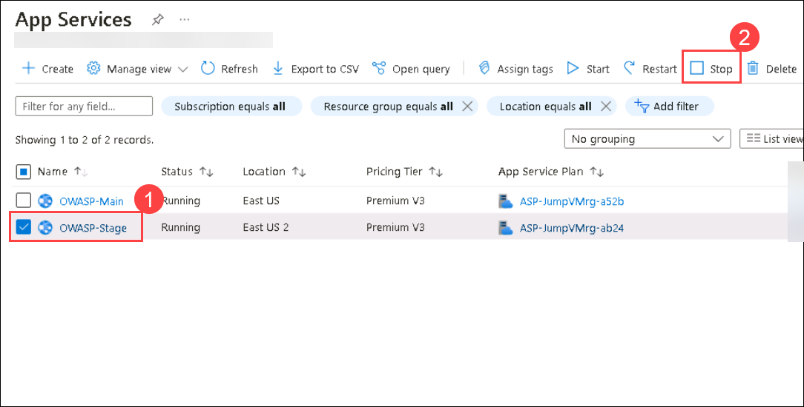

1. Switch back to your browser and select Refresh. This time, you should see an error message.

   

### **Task 5.4: Create a Rate Limit Rule**
  
1. Navigate to the **App services** tab. Select both of your web apps, then click **Start**, then click **Yes** to confirm.
  
   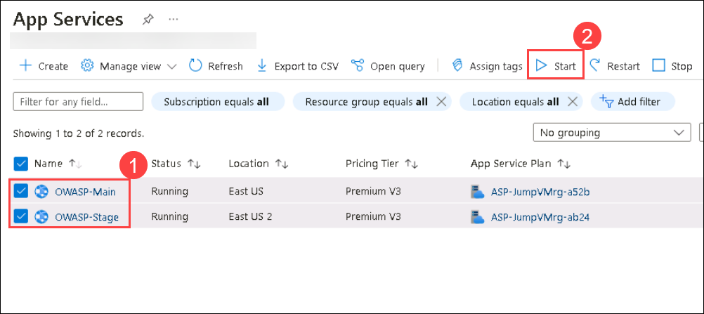

1. In a new browser tab paste the **endpoint** which you copied in the previous task.
  
   
  
1. Click on **Magnifying glass** on top right corner of the website to search.
  
   
  
1. Type in any keyword **(e.g. apple)** and you will see a response from the website. As this site is using JSON, try **refresh** in the browser to do the same search again and now you will not see any response message in the website as you saw previously.
  
   
  
     
  
1. In the Azure portal, search for **myWAFPolicy (1)** and select it from the results **(2)**.
  
   
  
1. On the **myWAFPolicy** page, under settings, click on **Custom rules (1)** and after that click on **+ Add custom rule (2)**.
  
   
  
1. On the **Add custom rule** blade, enter the following details
 
   - Custom rule name: Enter **rateLimitRule (1)**.
   - Rule type: Select **Rate limit (2)**
   - Priority: Enter **1 (3)**
   - Rate limit duration: Select **1 minute (4)**
   - Rate limit threshold (requests): Enter **100 (5)**
  
      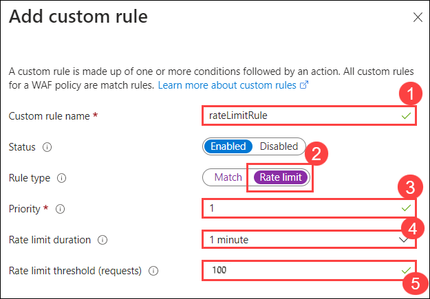
 
 1. In Conditions, enter the information required to specify a match condition to identify requests where the URL contains the string /promo:
  
    - Match type: Select **IP address**.
    - Match variable: Select **RemoteAddr**
    - Operation: Select **Does contain**
    - Match values: Enter **0.0.0.0/0** and **::/0**
    - Click on **Add**.
      
      
  
1. Select **Save**.
  
   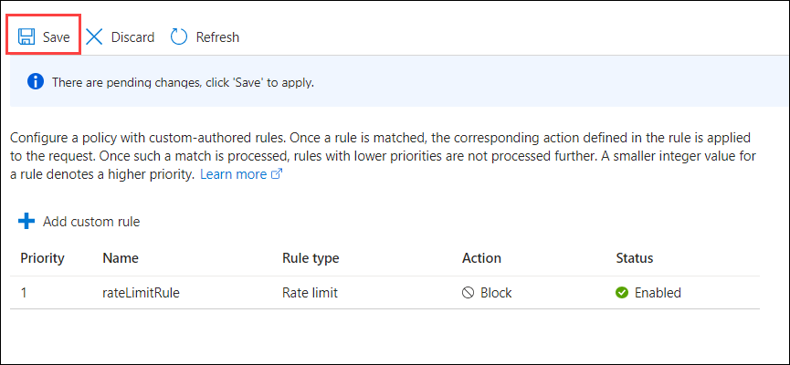
  
1. On the **myWAFPolicy** page, under settings, click on **Policy settings (1)** and you will notice that your block response status code is set to **403 (2)**. Enter **This is a rate limit test (3)** under the block response body and then click on **Save (4)**.
  
       
  

1. From the **Start (1)** menu, search for **Windows PowerShell ISE (2)** and open it **(3)**.

   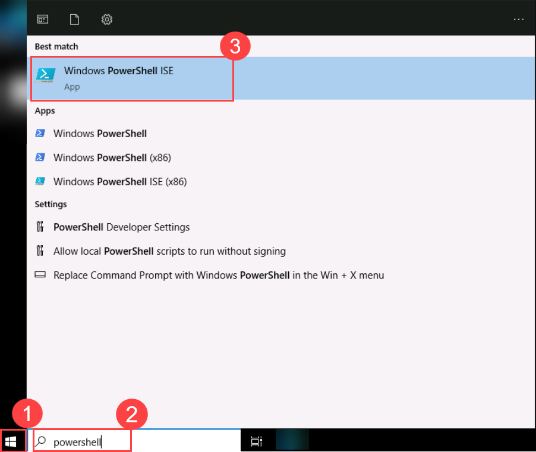

1. Run the command given below to enable the Windows Subsystem for Linux.

    ```
    dism.exe /online /enable-feature /featurename:Microsoft-Windows-Subsystem-Linux /all /norestart
    ```

    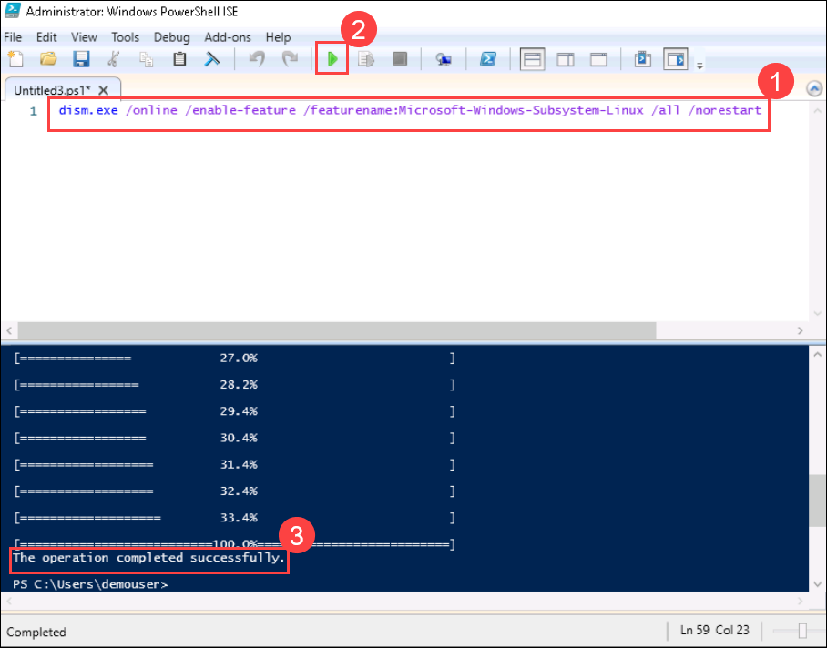
  
1. Navigate to the Azure portal and select the Azure Cloud Shell icon from the top menu.

   

1. Cloud Shell window will open at the bottom of your browser window, select **Bash** to configure the Cloud Shell.

   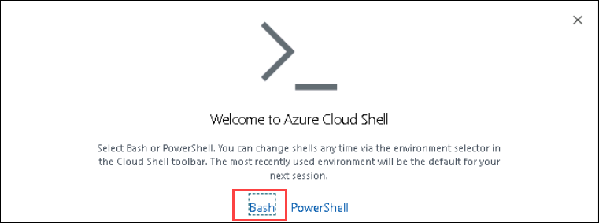

1. In the You have no storage mounted popup, click on **Create Storage**.
  
   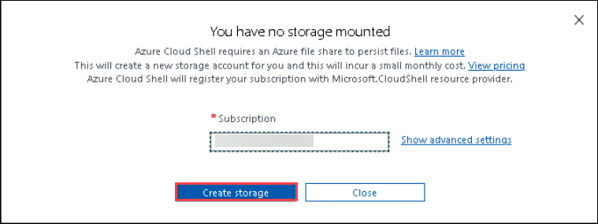
  

1. Once the bash shell is opened, run the below command to check the **Block response status code 403**.

   ```
   for a in {1..300} ; do curl -LIkm2  --write-out "%{http_code},%{time_total},%{time_connect},%{time_appconnect},%{time_starttransfer}\n"  --silent --output nul  https://contoso-frontend-ghbnd2bafvhmbzfs.z01.azurefd.net/#/search?q=apple &  done
   ```
   
   
   >**Note: Replace the Endpoint hostname that you copied in previous task and make sure your URL end with /#/search?q=apple &  done**.

1. You can see the output below, where they block the request 403.

   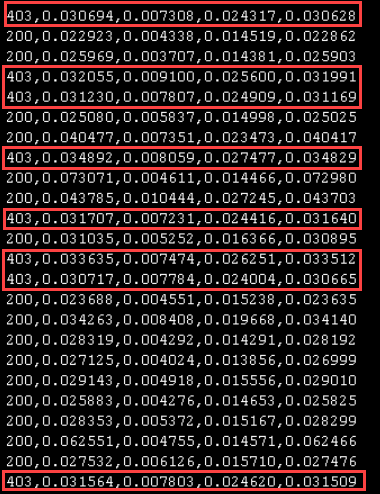

   >**Note: It might take up to 10 minutes to display the block request 403**.


  
  
  
  
  
  
  
