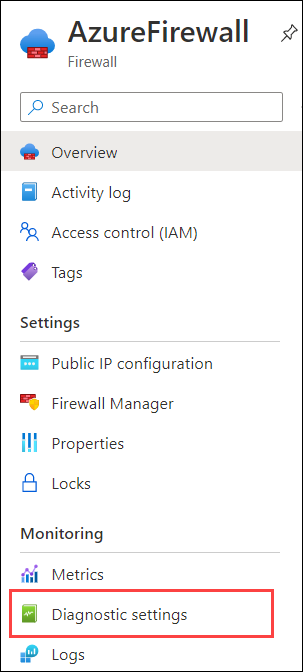
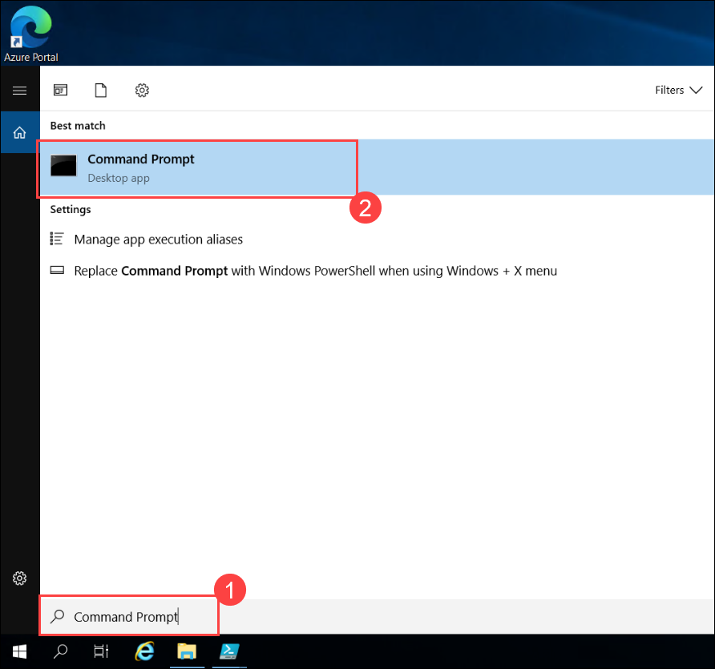
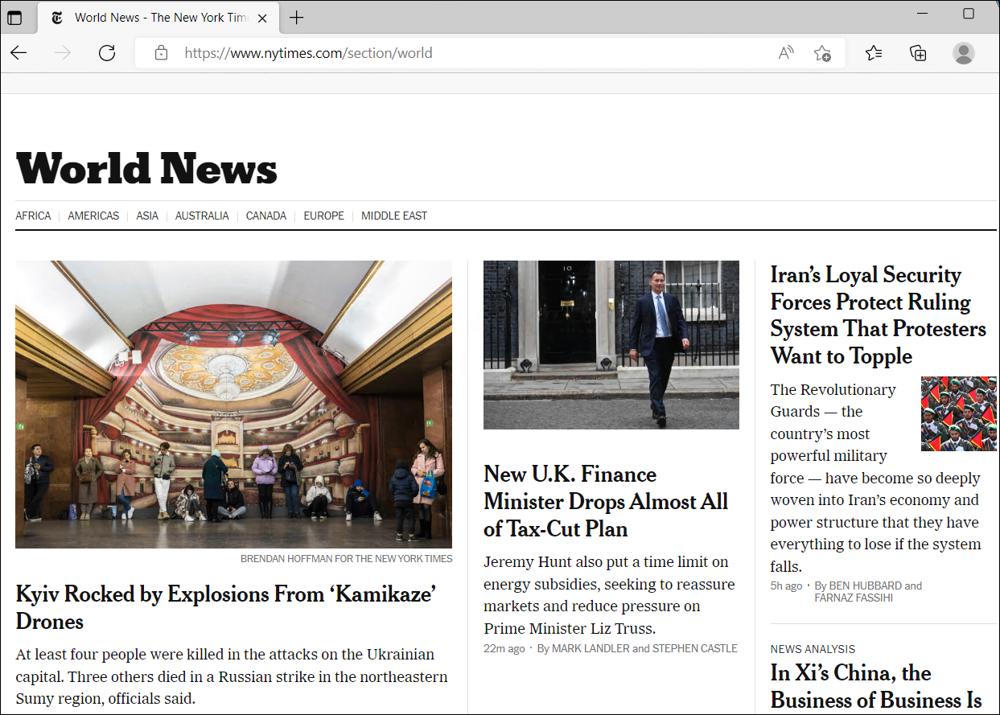

# Exercise 3: Azure Firewall Premium

Azure Firewall is a cloud-native and intelligent network firewall security service that provides the best of breed threat protection for your cloud workloads running in Azure. It's a fully stateful, firewall as a service with built-in high availability and unrestricted cloud scalability. It provides both east-west and north-south traffic inspection.

Azure Firewall Premium is a next generation firewall with capabilities that are required for highly sensitive and regulated environments. It includes the following features:

- **TLS Inspection** - decrypts outbound traffic, processes the data, then encrypts the data and sends it to the destination.
- **IDPS** - A network intrusion detection and prevention system (IDPS) allows you to monitor network activities for malicious activity, log information about this activity, report it, and optionally attempt to block it.
- **URL filtering** - extends Azure Firewall’s FQDN filtering capability to consider an entire URL. For example, `www.contoso.com/a/c` instead of `www.contoso.com`.
- **Web categories** - administrators can allow or deny user access to website categories such as gambling websites, social media websites, and others.
For more information, see https://learn.microsoft.com/en-us/azure/firewall/premium-features
 
## Test the Firewall

In this exercise you will explore on Azure Firewall premium features. 

### Task 1: Add firewall diagnostics settings 

In this task you will enable diagnostic settings in Azure Firewall to collect firewall logs.

1. In the Azure portal, navigate to your **JumpVM-rg** resource group and select the AzureFirewall resource.

   

2. On the firewall page, under **Monitoring**, select **Diagnostic settings**.

   

3. Select **Add diagnostic setting** on the **Diagnostic settings**. 

   

4. Now for **Diagnostic setting name** enter **fw-diagnostics**.

   

5. Under **Logs**, select **AzureFirewallApplicationRule**, and **AzureFirewallNetworkRule**.

   

6. Under **Destination details**, select **Send to Log Analytics workspace** and then click on **Save**.

   
   
### IDPS Tests

Azure Firewall Premium provides signature-based IDPS to allow rapid detection of attacks by looking for specific patterns, such as byte sequences in network traffic, or known malicious instruction sequences used by malware.

### Task 2: Test IDPS for HTTP traffic

In this task you will test IDPS for http traffic

1. On the JumpVM virtual machine, search for **Command Prompt (1)** and open  **Command Prompt (2)** window.

   

2. Type the following command at the command prompt:

   - Replace <your web server address> with JumpVm IP.

     `curl -A "HaxerMen" <your web server address>`
 
    
 
 3. In the custom prompt you will see your Web server response.
 
    
 
 4. Navigate to the Firewall Network rule logs on the Azure portal to find an alert similar to the following message:

    ```
    { “msg” : “TCP request from 10.0.100.5:16036 to 10.0.20.10:80. Action: Alert. Rule: 2032081. IDS: 
    USER_AGENTS Suspicious User Agent (HaxerMen). Priority: 1. Classification: A Network Tojan was 
    detected”}
    ```

    > [!NOTE]
    > It can take some time for the data to begin showing in the logs. Give it at least a couple minutes to allow for the logs to begin showing the data.
 
5. Now navigate back to firewallpolicy and under **Settings** select **IDPS**.
 
   
 
6. On the **IDPS** page select **Signature rules (1)** tab and under **Signature ID**, in the open text box type *2032081 (2)*.
 
   
 
7. Select *2032081 (1)* signature id  and click on **Edit Rules (2)**.
 
   
 
8. Under edit rules change **Signature Mode** to **Alert and Deny** and click on **Save**.  Wait for the deployment to complete before proceeding.
 
   

9. Navigate back to WorkerVM, and run the `curl` command again:

   `curl -A "HaxerMen" <your web server address>`

   Since the HTTP request is now blocked by the firewall, you'll see the following output after the connection timeout expires:

   `curl: (56) Recv failure: Connection was reset`
 
    

10. Go to the Monitor logs in the Azure portal and find the message for the blocked request.
 
### Task 4: Web categories testing
 
In this task you will create an application rule to allow access to sports web sites.

1. In the Azure portal, navigate to your **JumpVM-rg** ressource group and select **firewallpolicy**.
 
   
 
2. Select **Application Rules (1)** from Settings tab under Firewall Policy page and select **+ Add a rule collection (2)**.
   
   
 
3. Under **Add a rule collection** page, enter the below details:
 
    - Name: **GeneralWeb (1)**
    - Rule Collection type: **Application (2)**
    - Priority: **103 (3)**
    - Rule collection group: **DefaultApplicationRuleCollectionGroup (4)**
    - Under **Rules (5)** mention the below details:
      - Name: **AllowSports**
      - Source type: Select **IP Address** from the drop-down list
      - Source: Enter *
      - Protocol: Enter **http,https**
      - TLS inspection : Check TLS inspection
      - Destination Type: Select **Web categories**
      - Destination: Enter `Sports`
     
     - Click on **Add (6)**
 
     
 
 4. Once the deployment completes open a browser on JumpVM, navigate to `https://www.nfl.com` and verify you are able to see the NFL web page.
 
    
 
 5. Now navigate to your log analytics workspace and in Application rule Monitoring logs review the **web Category: Sports rule** was matched and the request was allowed.
 
  

### Task 5: Implement and Test URL filtering
 
 1. In the Azure portal, navigate to your **JumpVM-rg** ressource group and select **firewallpolicy**.
 
    
 
 2. Select **Application Rules (1)** from Settings tab under Firewall Policy page and select **+ Add a rule collection (2)**.
 
    
 
 3. Under **Add a rule collection** page, enter the below details:

    - Name: **Firewall-rulecollection (1)**
    - Rule Collection type: **Application (2)**
    - Priority: **100 (3)**
    - Rule collection group: **DefaultApplicationRuleCollectionGroup (4)**
    - Under **Rules (5)** mention the below details:
      - Name: **URLFiltering**
      - Source type: Select **IP Address** from the drop-down list
      - Source: Enter *
      - Protocol: Enter **http,https**
      - TLS inspection : Check TLS inspection
      - Destination Type: Select **URL**
      - Destination: Enter `www.nytimes.com/section/world`
     
     - Click on **Add (6)**
 
     
 
 4. Once the deployment completes open a browser on JumpVM, navigate to `https://www.nytimes.com/section/world` and validate that the HTML response is displayed as expected in the browser.

    
 
 5. In the Azure portal, navigate to your log analytics workspace and in Application rule Monitoring logs review the entire URL.
 
 
 ### Task 6: DDOS protection

 
    

