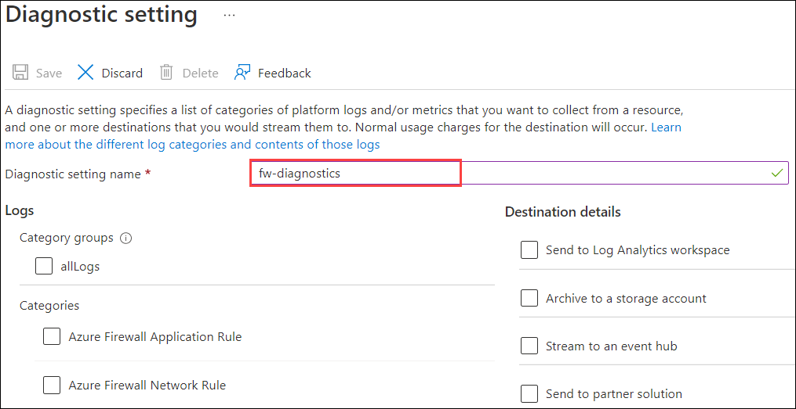
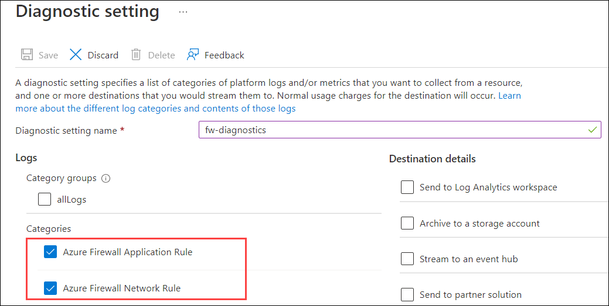

# Exercise 3: Azure Firewall Premium

Azure Firewall is a cloud-native and intelligent network firewall security service that provides the best of breed threat protection for your cloud workloads running in Azure. It's a fully stateful, firewall as a service with built-in high availability and unrestricted cloud scalability. It provides both east-west and north-south traffic inspection.

Azure Firewall Premium is a next generation firewall with capabilities that are required for highly sensitive and regulated environments. It includes the following features:

- **TLS Inspection** - decrypts outbound traffic, processes the data, then encrypts the data and sends it to the destination.
- **IDPS** - A network intrusion detection and prevention system (IDPS) allows you to monitor network activities for malicious activity, log information about this activity, report it, and optionally attempt to block it.
- **URL filtering** - extends Azure Firewall’s FQDN filtering capability to consider an entire URL. For example, `www.contoso.com/a/c` instead of `www.contoso.com`.
- **Web categories** - administrators can allow or deny user access to website categories such as gambling websites, social media websites, and others.
For more information, see https://learn.microsoft.com/en-us/azure/firewall/premium-features
 
 
## Test the firewall

In this exercise you will explore on Azure Firewall premium features. 

### Add firewall diagnostics settings 

In this task you will enable diagnostic settings in Azure Firewall to collect firewall logs.

1. In the Azure portal, navigate to your **JumpVM-rg** resource group and select the AzureFirewall resource.

   

2. On the firewall page, under **Monitoring**, select **Diagnostic settings**.

   

3. Select **Add diagnostic setting** on the **Diagnostic settings**. 

   

4. Now for **Diagnostic setting name** enter **fw-diagnostics**.

   

5. Under **Logs**, select **AzureFirewallApplicationRule**, and **AzureFirewallNetworkRule**.

   

6. Under **Destination details**, select **Send to Log Analytics workspace** and then click on **Save**.

   
   
### IDPS Tests

Azure Firewall Premium provides signature-based IDPS to allow rapid detection of attacks by looking for specific patterns, such as byte sequences in network traffic, or known malicious instruction sequences used by malware.

In this task you will test IDPS for http and https traffic

1. 

