# Exercise 4: Azure Sentinel
## Lab objectives
In this lab, you will complete the following exercise:
1. What is Microsoft Sentinel
1. Onboard Azure Subscription to Azure sentinel
1. Onboard the Web App – IaaS server to sentinel
1. Explore query logs

# Task 1: What is Microsoft Sentinel?

Microsoft Sentinel is a scalable, cloud-native solution that provides:
- Security information and event management (SIEM).
- Security orchestration, automation, and response (SOAR).

 Microsoft Sentinel delivers intelligent security analytics and threat intelligence across the enterprise. With Microsoft Sentinel, you get a single solution for attack detection, threat visibility, proactive hunting, and threat response.

Microsoft Sentinel is your bird's-eye view across the enterprise alleviating the stress of increasingly sophisticated attacks, increasing volumes of alerts, and long resolution time frames.
1. **Collect data at cloud scale** across all users, devices, applications, and infrastructure, both on-premises and in multiple clouds.
1. **Detect previously undetected threats**, and minimize false positives using Microsoft's analytics and unparalleled threat intelligence.
1. **Investigate threats with artificial intelligence**, and hunt for suspicious activities at scale, tapping into years of cyber security work at Microsoft.
1. **Respond to incidents rapidly** with built-in orchestration and automation of common tasks.

    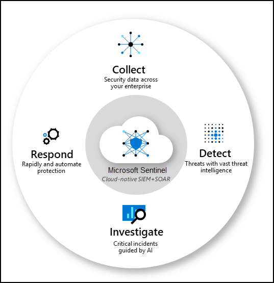
    
# Task 2: Onboard Azure Subscription to Azure sentinel

1. In Azure portal, search **microsoft-sentinel (1)** and select **microsoft-sentinel (2)**.

    
 
1. On the Microsoft Sentinel page, click on **Create**.

    

1. If there is no Log Analytic workspace pre-created then click on ** + Create a new workspace**, else continue from step 8.

     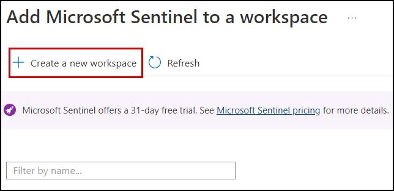
     
1. On **Log Analytics workspace** page, provide the information as mentioned below,
   - Subscription: **Leave it as default (1)**
   - Resource Group: **JumpVM-rg (2)**.
   - Name: Enter **log-analytics (3)**.
   - Region: Select **East US (4)** from the drop-down list
   - Click on **Tags (5)** to continue.

     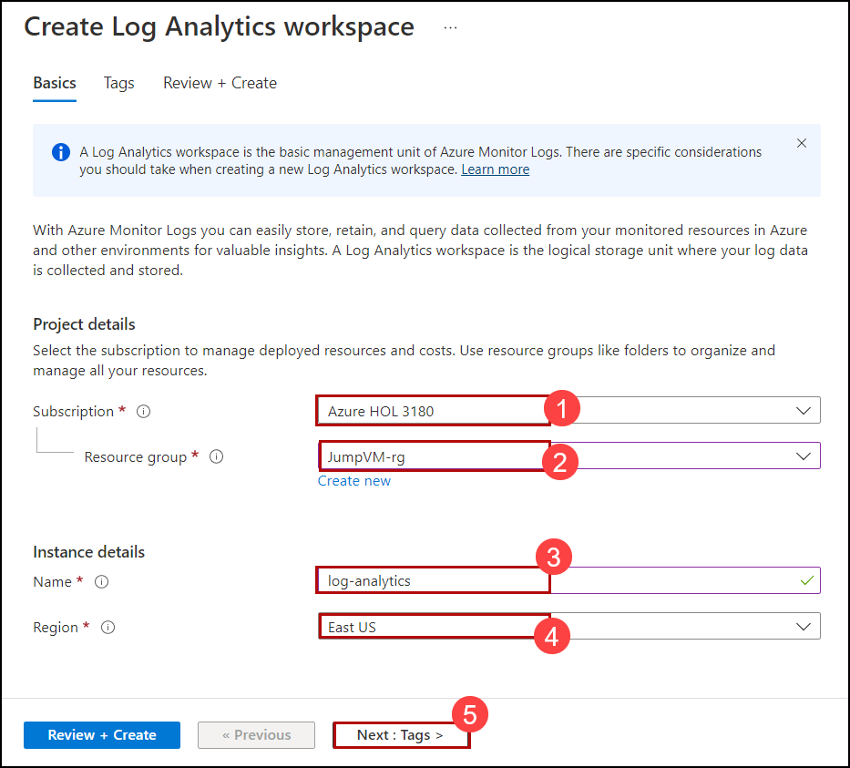
     
1. On the **Tags** tab, leave everything to default and then  click on **Review + create**.

     
  
1. If the validation is passed then  click on **Create**.

     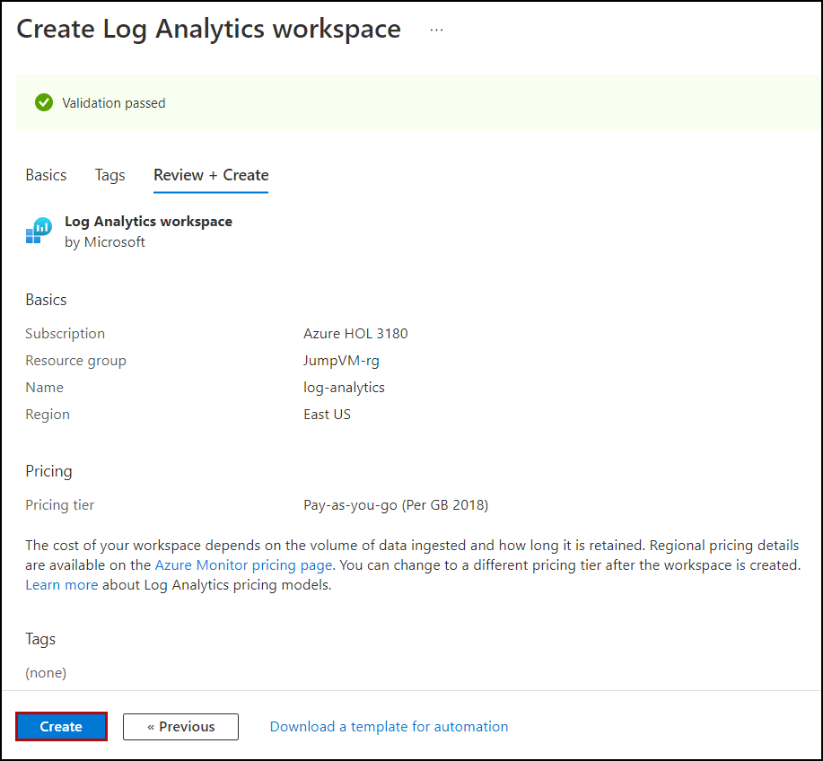
    
   >**NOTE**: It may take a couple of minutes for the workspace to be created.

1. Once the Log Analytics workspace is added you will see a notification that says **Successfully added Log Analytics workspace**, as shown below.

      

1. now under **add Microsoft Sentinel to a workspace** page, select **log-analytics** workspace Click on **Add**.

      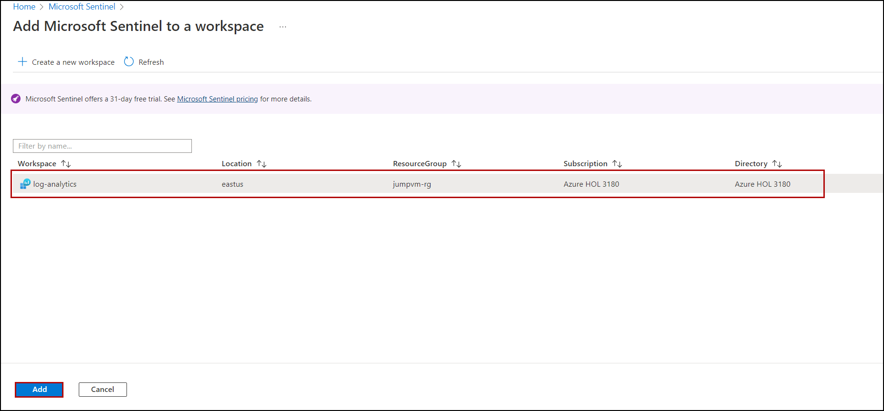
      
1. Once the Microsoft Sentinel is added you will see another notification that says **Successfully added Azure Sentinel**, as shown below.

      

1. This is the default page you will be taken to once your new Azure Sentinel instance is created.

     
     
1. Now, click on **Workbooks (1)** from the left pane under Threat management, and search  **WAF (2)** and select **Microsoft Web Application Firewall      (WAF) - Azure WAF (3)** from the search results.

    

1. Then from the bottom-right corner of the Azure portal, click on **Save (1)** and then click on **OK (2)** to save the workbook.

    
    
1. Once the **Workbook** is added, you will see notification that says **Workbook 'Microsoft Web Application Firewall (WAF) - Azure WAF saved successfully**, as shown below.

   

1. On the left hand blade of Microsoft Sentinel page, under configuration, click on **Settings (1)** and then click on **Workspace settings (2)**.

    

1. On the Log Analytics workspace page, under Connect a data source, click on **Azure virtual machines (VMs)**.

    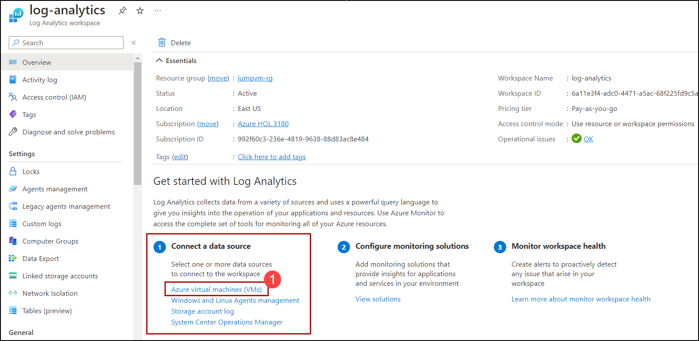

1. You will see that virtual machine is not connected with Log Analytics connection. So now click on **VM Name** to connect with Log Analytics connection

    
      
1. Click on **Connect**.

    
     
1. Once the VM is connected you will see the notification which says **Successfully connected virtual machine** as shown below.

    

    >**NOTE**: Azure sentinel will takes around 20 minutes to load and display the data, meanwhile you can continue with the lab and we will explore on the data            collected by log analytics in task 4.    
     
# Task 3: Onboard the Web App – IIS server to sentinel

1. In Azure portal, Search **Log Analytics workspace (1)** and Select **Log Analytics workspace (2)**.

     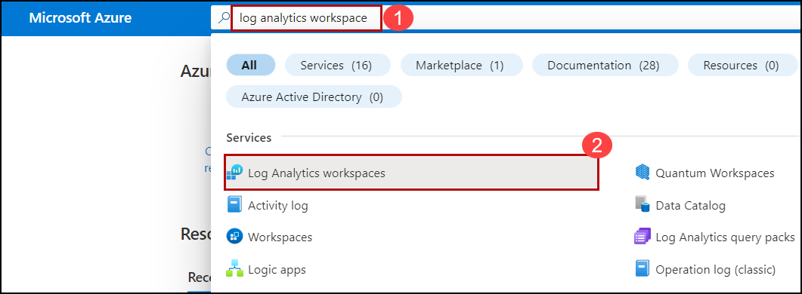

1. On log analytics workspace, Select your **workspace Name (1)**. Under setting click on **Agents management (2)** after that select **Log Analytics agent                instructions (3)** and then click on **Download Windows Agent [64 bit] (4)**. Copy the **Workspace ID (5)** and **Primary key (6)** and save it to notepad we can      use it later.

     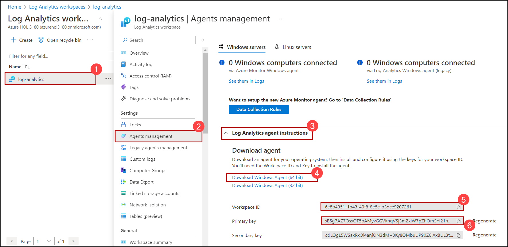

1. Now, click on three dots **[...] (1)** and go to **downloads (2)**.

     

1. You will see the **MMA setup**. Now click on **open file**.

     

1. On Microsoft monitoring agent setup wizard, click on **Next**.

     
   
1. Click on **I Agree**.

      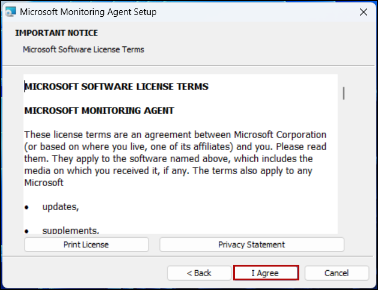
 
1. Click on **Next**.

      

1. Select the **Connect the agent to azure log analytics(OMS)** then click on **Next**.

      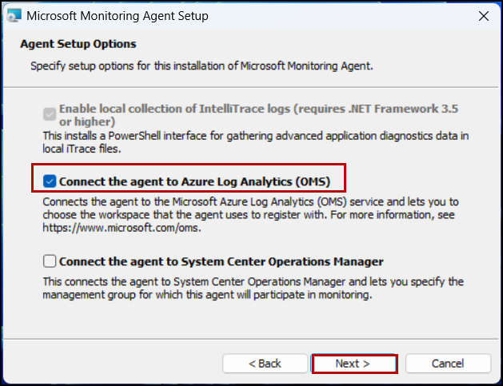

1. Enter the **Workspace ID (1)** and **Workspace key or Primary key (2)** that you are noted in step 2, click on **Next (3)**.

      

1. Click on **Install**.

      

1. You will see that Microsoft monitoring agent configuration completed successfully, click on **Finish**.

      
      
     >**NOTE**: Wait for 30 minutes to see that your window computer is connected.

1. Back on **log analytics workspce** blade, Select your **workspace Name (1)**. Under setting click on **Agents management (2)** and you will see that **1 Windows        computers connected (3)**

      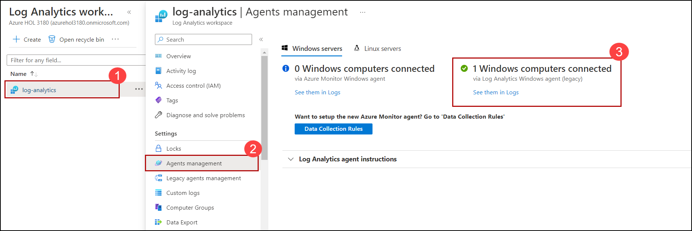

1. If you want to see the logs, click on **See them in logs**.

      

1. You will see that the **MMA** query is running automatically and you also seen the results.

     

# Task 4: Explore query logs

1. Now, go back to **Microsoft Sentinel Overview** blade by clicking on Overview under General section on the left and, then click on **Heartbeat** to query the           VM insights. Count of **Events** could be different on your Microsoft Sentinel Dashboard.

    

1. Click on **Run** You will see results for **union Heartbeat** in query explorer. You can see operations around Network, Logical Disk, Memory, and Processor for        VM. If you are not able to see the results, then try to adjust the query editor size and you will be able to see the outcome.

    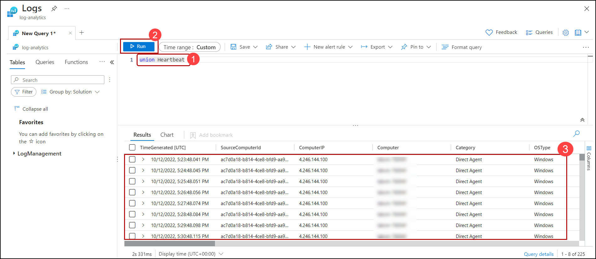
     
1. You can save the query for later use by clicking on the **Save (1)** and then **Save as query (2)** button.
  
     

1. Now, provide **VMProcess** for the **Query name (1)**, then click on **Save (2)**.

    

1. Once the Query is saved you will see the notification which says **Successfully saved query** as shown below.

    

1. You can see and run the saved **queries** by browsing to **Queries**

    

1. Under all queries select **others (1)** then, you will find `VMProcess` query under **Queries**, and then click on **Run** to run the saved querie.

    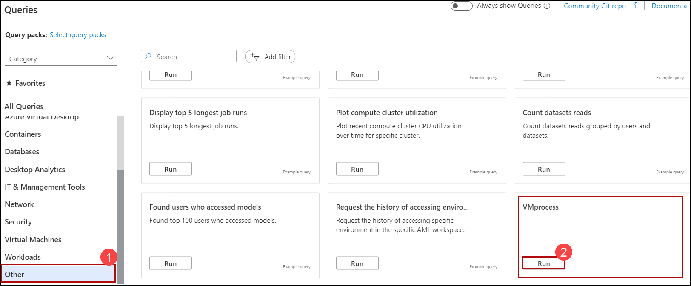

1. Now close the blade go back to the **Microsoft sentinel** overview page.

    
     
1. On the **Microsoft sentinel** overview page, under General section on the left and, then click on **usage** to query the VM insights.

    
    
1.  Click on **Run** You will see results for **union usage** in query explorer. You can see operations around Network, Logical Disk, Memory, and Processor for             VM. If you are not able to see the results, then try to adjust the query editor size and you will be able to see the outcome.

     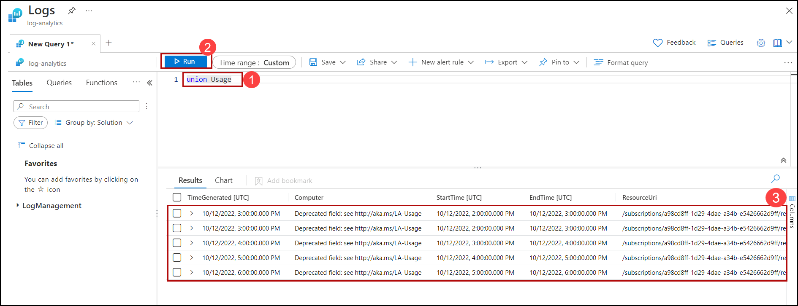

    
