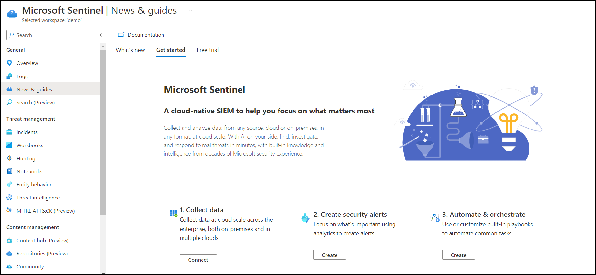
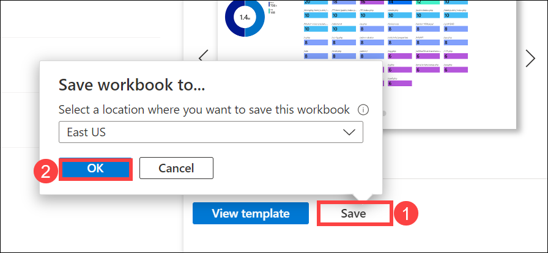

# Exercise 4: Azure Sentinel
## Lab objectives
In this lab, you will complete the following exercise:
1. What is Microsoft Sentinel
1. Onboard Azure Subscription to Azure sentinel
1. Onboard the Web App – IaaS server to sentinel
1. Explore and query logs

# Task 1: What is Microsoft Sentinel?

Microsoft Sentinel is a scalable, cloud-native solution that provides:
- Security information and event management (SIEM).
- Security orchestration, automation, and response (SOAR).

 Microsoft Sentinel delivers intelligent security analytics and threat intelligence across the enterprise. With Microsoft Sentinel, you get a single solution for attack detection, threat visibility, proactive hunting, and threat response.

Microsoft Sentinel is your bird's-eye view across the enterprise alleviating the stress of increasingly sophisticated attacks, increasing volumes of alerts, and long resolution time frames.
1. **Collect data at cloud scale** across all users, devices, applications, and infrastructure, both on-premises and in multiple clouds.
1. **Detect previously undetected threats**, and minimize false positives using Microsoft's analytics and unparalleled threat intelligence.
1. **Investigate threats with artificial intelligence**, and hunt for suspicious activities at scale, tapping into years of cyber security work at Microsoft.
1. **Respond to incidents rapidly** with built-in orchestration and automation of common tasks.

    
    
# Task 2: Onboard Azure Subscription to Azure sentinel

1. In Azure portal, Search **microsoft-sentinel (1)** and Select **microsoft-sentinel (2)**.

    
 
1. On the Microsoft Sentinel page, Click on **Create**.

    

1. If there is no already a Log Analytic workspace that you can use click **Create a new workspace**.

     
     
1. On **Log Analytics workspace** page, provide the information as mentioned below,
   - Subscription: **Leave it as default**
   - Resource Group: Enter **JumpVM-rg**.
   - Name: Enter a Unique value.
   - Region: Select **East US** from the drop-down list
   - Click on **Review and Create** to continue.

     
  
1. If Validations is passed click on **Create** to create your new Log Analytics workspace.

     
    
   >**NOTE**: It may take a Couple of minutes for the workspace to be Created.

1. Click on **ADD**.

      

1. This is the default page you will be taken to once your new Azure Sentinel instance has been created. After this, the overview page will be the default page shown.

     
     

     
     
# Task 3: Onboard the Web App – IIS server to sentinel

# Task 4: Explore Azure Sentinel and query logs

1. Now, click on the **Workbooks** from the left pane under the Threat Management section and search for WAF and select **Microsoft Web Application Firewall (WAF) - Azure WA** from the search result.

     

2. Then from the bottom-right corner of the Azure portal, click on **Save** and then on **OK** to save the workbook.

    
    
3. 
  
