# Exercise 4: Azure Sentinel

In this exercise, you will explore about Microsoft Sentinel, Onboarding Azure Subscriptions and Web App – IaaS server to Sentinel. You will run the queries from Microsoft Sentinal logs and will explore through the results.

This exercise includes the following tasks:

  - What is Microsoft Sentinel
  - Onboard Azure Subscription to Azure sentinel
  - Onboard the Web App – IaaS server to sentinel
  -  Explore query logs

### Task 1: What is Microsoft Sentinel?

Microsoft Sentinel is a scalable, cloud-native solution that provides:
- Security information and event management (SIEM).
- Security orchestration, automation, and response (SOAR).

 Microsoft Sentinel delivers intelligent security analytics and threat intelligence across the enterprise. With Microsoft Sentinel, you get a single solution for attack detection, threat visibility, proactive hunting, and threat response.  To learn more about Microsoft Sentinel refer: `https://learn.microsoft.com/en-us/azure/sentinel/overview`

Microsoft Sentinel is your bird's-eye view across the enterprise alleviating the stress of increasingly sophisticated attacks, increasing volumes of alerts, and long resolution time frames.
1. **Collect data at cloud scale** across all users, devices, applications, and infrastructure, both on-premises and in multiple clouds.
1. **Detect previously undetected threats**, and minimize false positives using Microsoft's analytics and unparalleled threat intelligence.
1. **Investigate threats with artificial intelligence**, and hunt for suspicious activities at scale, tapping into years of cyber security work at Microsoft.
1. **Respond to incidents rapidly** with built-in orchestration and automation of common tasks.

    
    
### Task 2: Onboard Azure Subscription to Azure sentinel

In this task, you will onboard the Azure subscription to Azure sentinel by congiguring the new Log Analytics workspace from sentinel.

1. In Azure portal, search **microsoft-sentinel (1)** and select **microsoft-sentinel (2)**.

    
 
1. On the Microsoft Sentinel page, click on **Create**.

    

1. If there is no Log Analytic workspace pre-created then click on **+ Create a new workspace**, else continue from step 8.

     
     
1. On **Log Analytics workspace** page, provide the information as mentioned below,
   - Subscription: **Leave it as default (1)**
   - Resource Group: **JumpVM-rg (2)**.
   - Name: Enter **log-analytics (3)**.
   - Region: **East US**
   - Click on **Tags (5)** to continue.

     
     
1. On the **Tags** tab, leave everything to default and then  click on **Review + create**.

     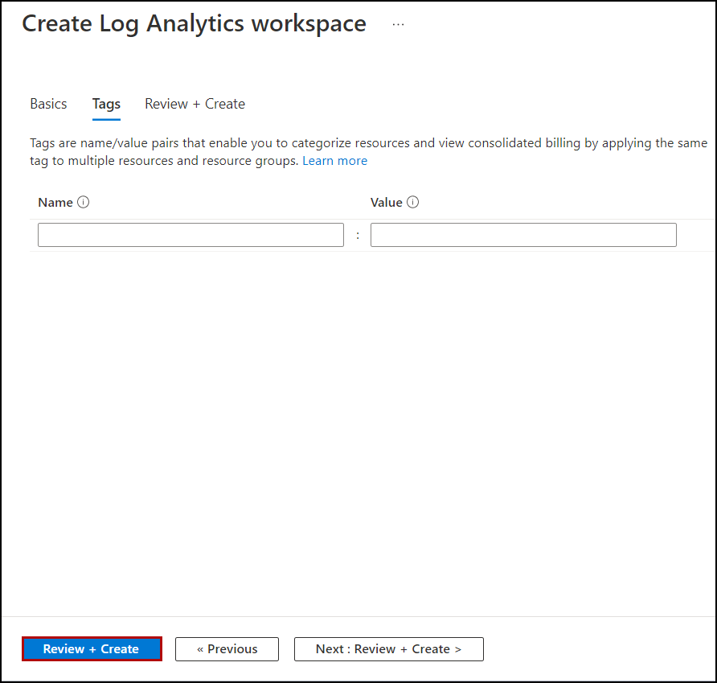
  
1. If the validation is passed then  click on **Create**.

   >**NOTE**: It may take a couple of minutes for the workspace to be created.

     
      
1. Once the Log Analytics workspace is added you will see a notification that says **Successfully added Log Analytics workspace**, as shown below.

      

1. now under **add Microsoft Sentinel to a workspace** page, select **log-analytics** workspace Click on **Add**.

      
      
1. Once the Microsoft Sentinel is added you will see another notification that says **Successfully added Azure Sentinel**, as shown below.

      

1. This is the default page you will be taken to once your new Azure Sentinel instance is created.

     
     
1. Now, click on **Workbooks (1)** from the left pane under threat management, and search  **WAF (2)** and select **Microsoft Web Application Firewall      (WAF) - Azure WAF (3)** from the search results.

    

1. Then from the bottom-right corner of the Azure portal, click on **Save (1)** and then click on **OK (2)** to save the workbook.

    
    
1. Once the **Workbook** is added, you will see notification that says **Workbook 'Microsoft Web Application Firewall (WAF) - Azure WAF saved successfully**, as shown below.

   

1. On the left hand blade of Microsoft Sentinel page, under configuration, click on **Settings (1)** and then click on **Workspace settings (2)**.

     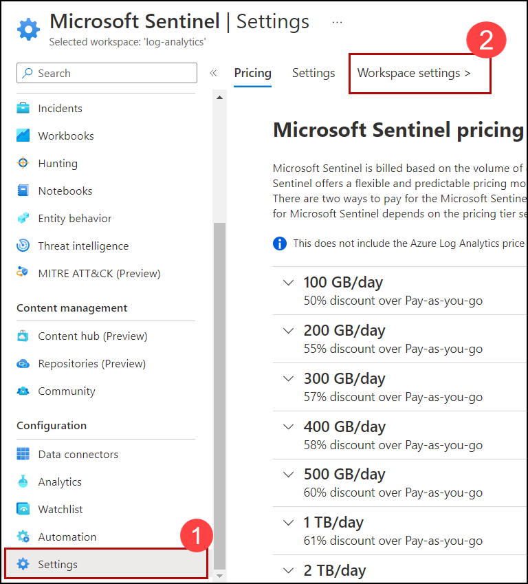

1. On the Log Analytics workspace page, under Connect a data source, click on **Azure virtual machines (VMs)**.

   

1. You will see that the virtual machine is not connected to the Log Analytics Connection. Now, click on **JumpVM-<inject key="Deployment ID" />** to connect with Log Analytics Connection

    
      
1. Click on **Connect**.

    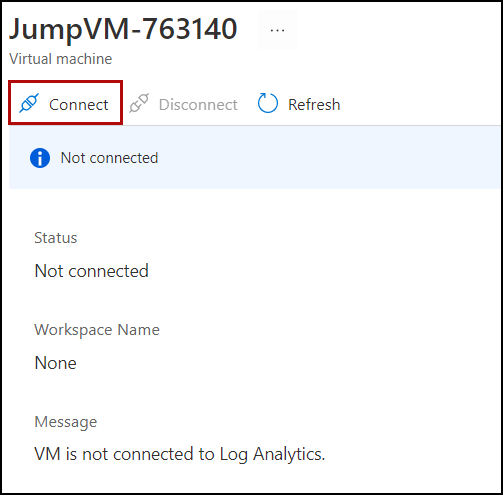
     
1. Once the VM is connected you will see the notification that says **Successfully connected virtual machine**, as shown below.

    

    >**NOTE**: Azure sentinel will take around 30 minutes to load and display the data, meanwhile you can continue with the lab and  we will explore the data            collected by log analytics in task 4.    
     
### Task 3: Onboard the Web App – IIS server to sentinel

In this task, you will onboard the web app -  IIS server to sentinal by configuring the log Analytics agent.

1. In Azure portal, search **Log Analytics workspace (1)** and select **Log Analytics workspace (2)** from the search results.

     

1. On the  log analytics workspace page, select **log-analytics (1)**, and under settings, click on **Agents management (2)** after that expand **Log Analytics agent                instructions (3)**, and then click on **Download Windows Agent [64 bit] (4)**. Copy the **Workspace ID (5)** and **Primary key (6)**, then save it to notepad for later use.

     

1. Now, on your web browser, click on three dots **[...] (1)** and, go to **Downloads (2)**.

     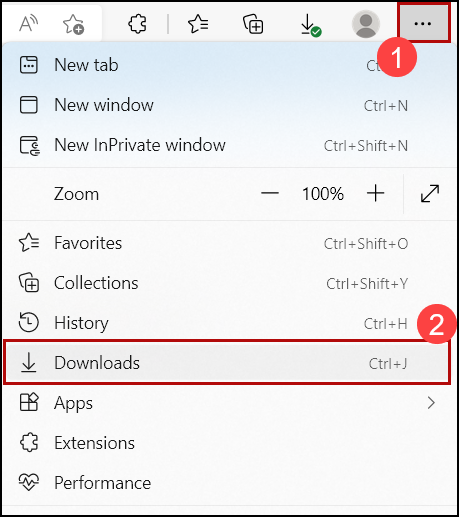

1. You will see a file name **MMASetup-AMD64.exe**, here click on **Open file**.

     

1. On the Microsoft Monitoring Agent Setup Wizard, click on **Next**.

     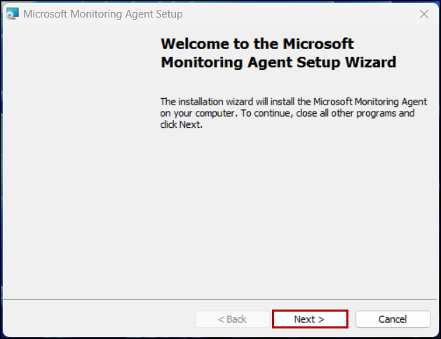
   
1. Now under Microsoft Software License Terms, click on **I Agree**.

      
 
1. Under Destination Folder page leave the path to default, and Click on **Next**.

      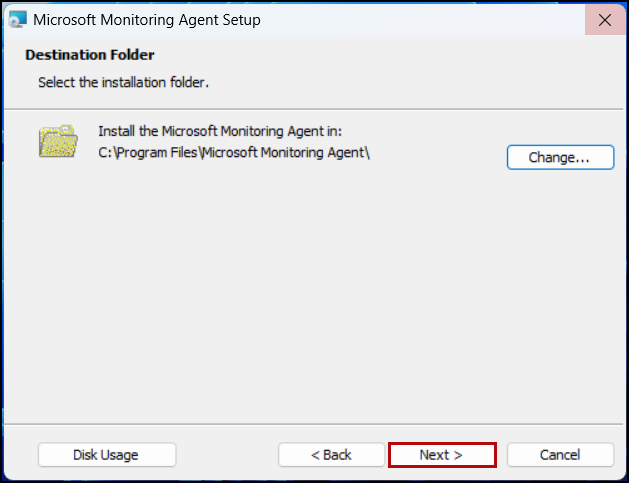

1. Now under Agent Setup Options, select the checkbox **Connect the agent to Azure Log Analytics (OMS)**, then click on **Next**.

      

1. Enter the **Workspace ID (1)** and **Workspace key or Primary key (2)** that you are noted in step 2, then click on **Next (3)**.

      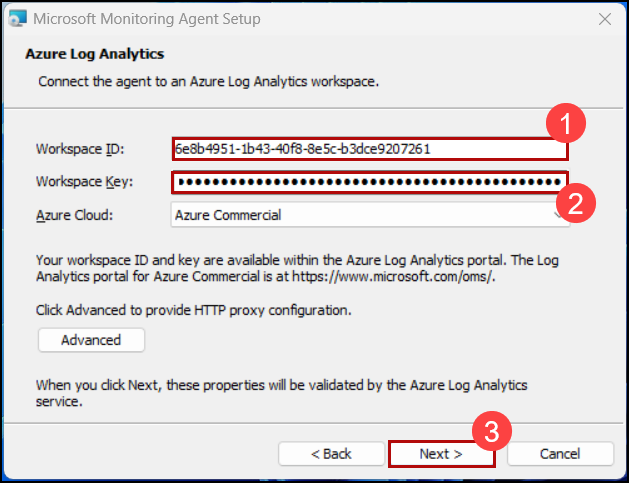

1. Under Ready to Install page, click on **Install**.

      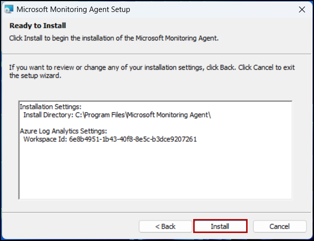

1. Once the  Microsoft Monitoring Agent configuration is completed successfully, click on **Finish**.

      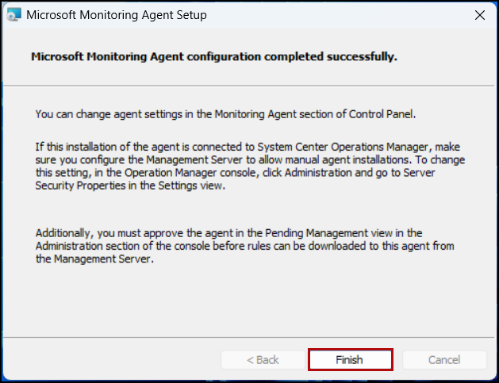

1. On the **log analytics workspace** page, click on **log-analytics (1)**, then click on **Agents management (2)** under settings and you will see **1 Windows        computers connected (3)**
   >**NOTE**: It will takes around 2-3 minutes, for the log analytics agent to connect with virtual machine, wait for it to complete before proceeding with the lab.

      

1. To explore more on logs, click on **See them in Logs**.

      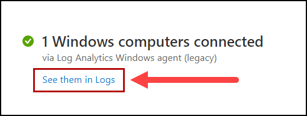

1. Here you will see the **MMA** query running automatically, and the query result below it.

     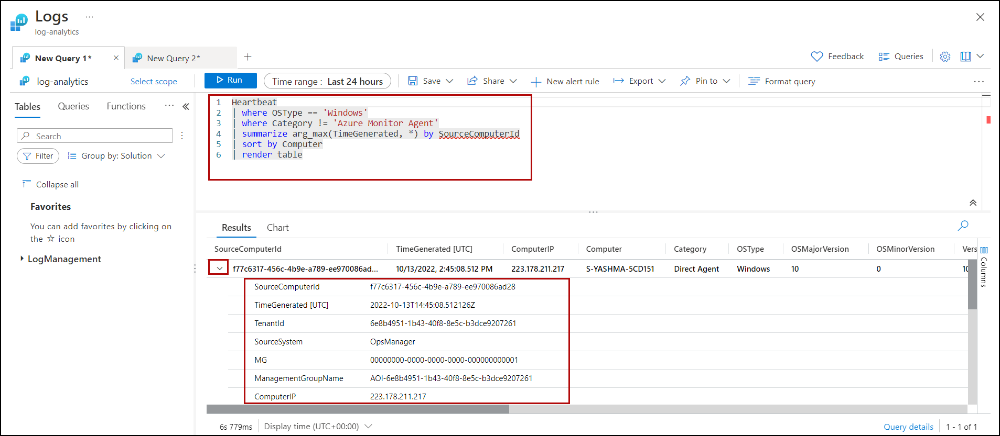

### Task 4: Explore query logs

In this task, you will run the queries in Microsoft sentinel to check the health status and usage of Network, Logical Disk, Memory, and Processor for VM.

1. Now, go back to **Microsoft Sentinel |Overview** page by clicking on **Overview (1)** under General on the left hand side blade, and then click on **Heartbeat          (2)**.
    
    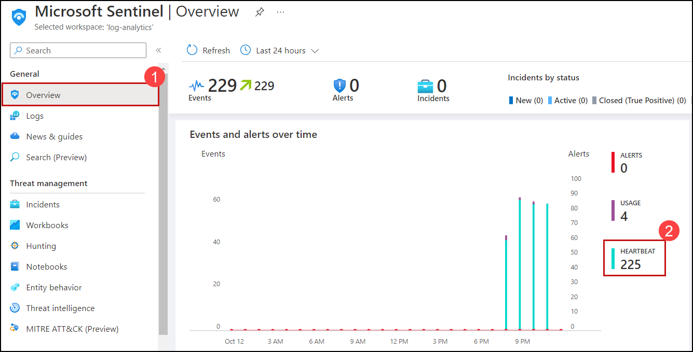
    
    >**NOTE**: Your hearbeat count may varyfrom the screenshot above. 

1. Now under **Logs** page, click on **Run** , Here you will see results of  **union Heartbeat** query in query explorer. Here you can see operations around Network, Logical Disk, Memory, and Processor for VM. If you are not able to see the results, then try to adjust the query editor size and you will be able to see the outcome.

    
     
1. You can save the query for later use by clicking on the **Save (1)** and then select **Save as query (2)**.
  
     

1. Now under **Save as query** blade, enter **VMProcess (1)** as Query name, and then click on **Save (2)**.

    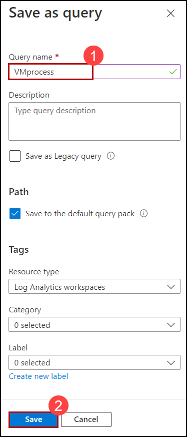

1. Once the Query is saved you will see the notification thats says **Successfully saved query**, as shown below.

    

1. Now click on **Queries**, to browse the saved queries in queries explorer.

    

1. On the **Queries** page, under All Queries, scroll down to **Other (1)**, and then click on **Run (2)** under **VMprocess** to run the saved query.

    

1. Now click on **X** on the top right corner to return to the **Microsoft sentinel** overview page.

    
     
1. On the  Microsoft Sentinel **Overview** page, click on **USAGE (2)**.

    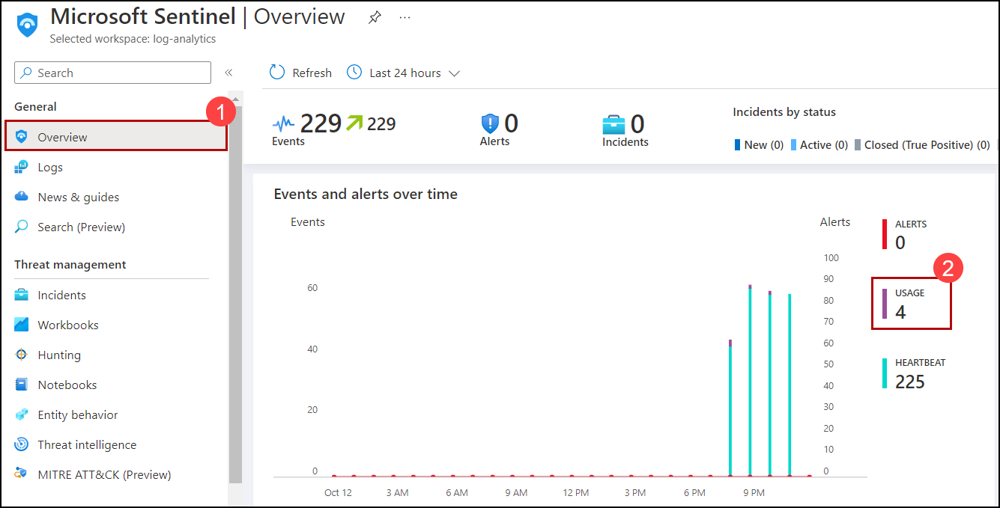
    
1.  Now under **Logs** page, click on **Run (2)** , Here you will see results of  **union usage** query in query explorer. Here you can see operations around Network, Logical Disk, Memory, and Processor for VM. If you are not able to see the results, then try to adjust the query editor size and you will be able to see the outcome.

     
     
     
     
 ## Summary
 
In this exercise you have covered the following:
   - Explored Microsoft Sentinel 
   - Onboarded Azure Subscription to Azure sentinel 
   - Onboarded the Web App – IaaS server to sentinel 
   - Explored on query logs

