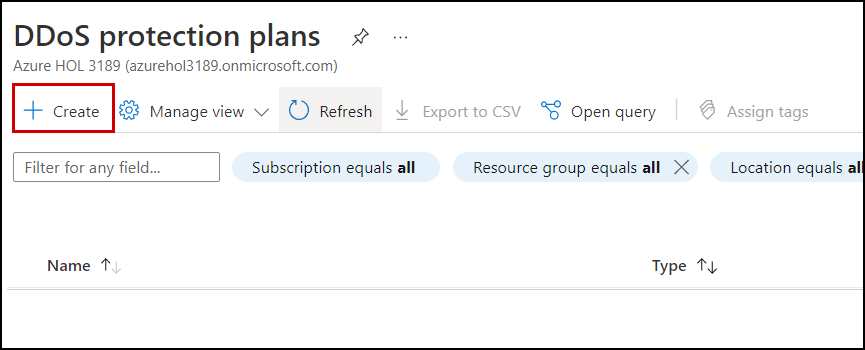
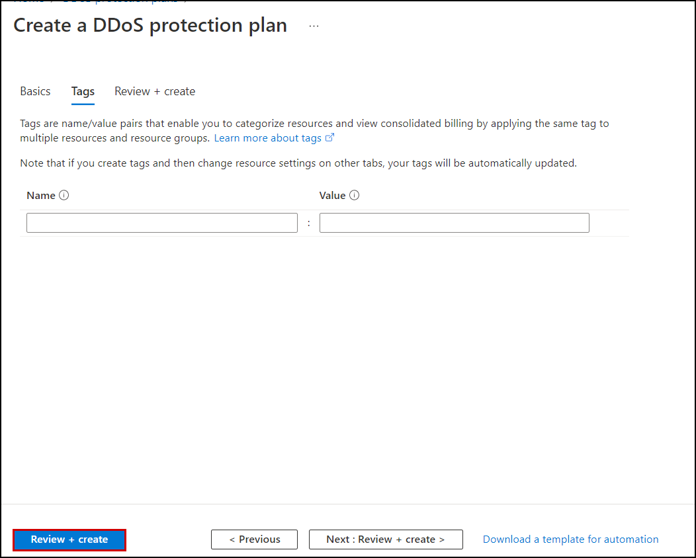
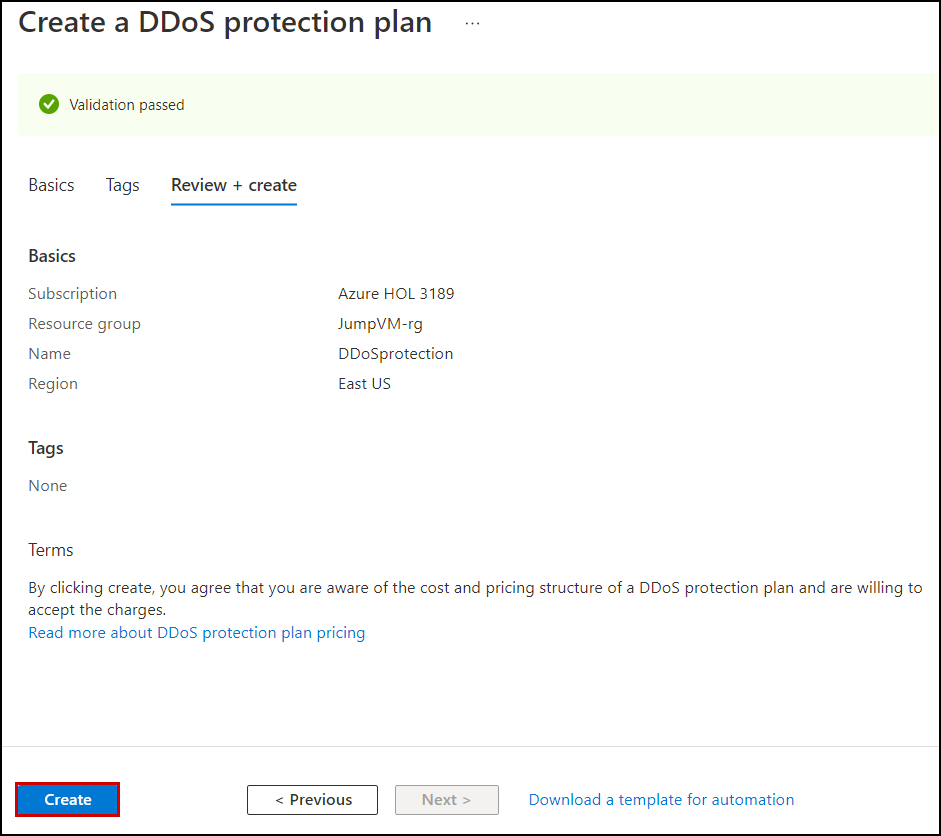
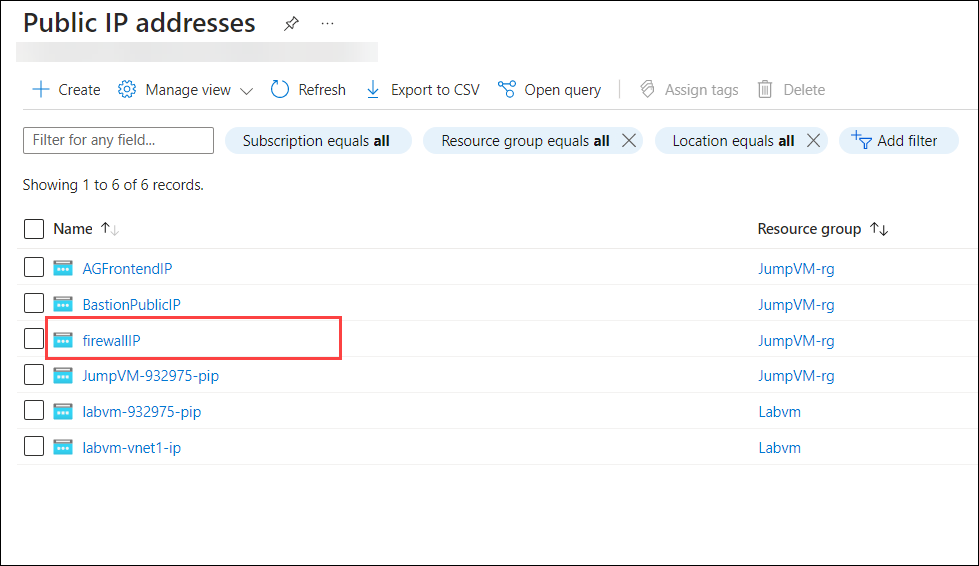
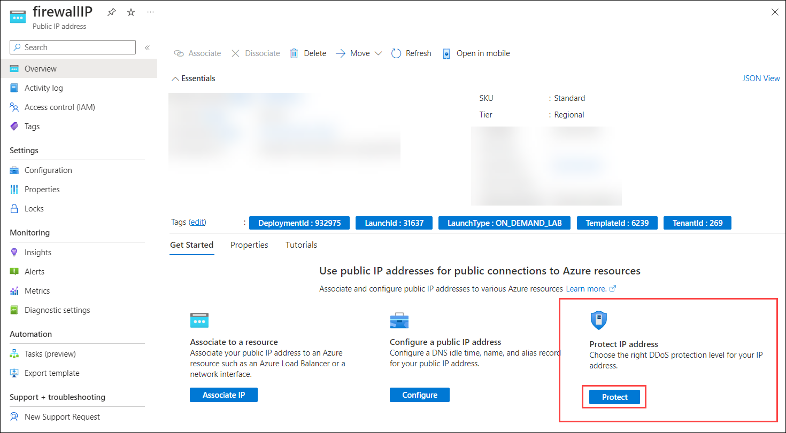
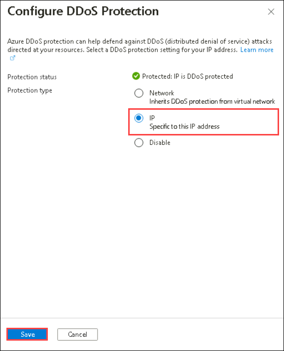
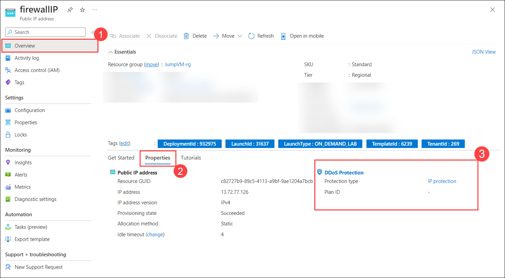
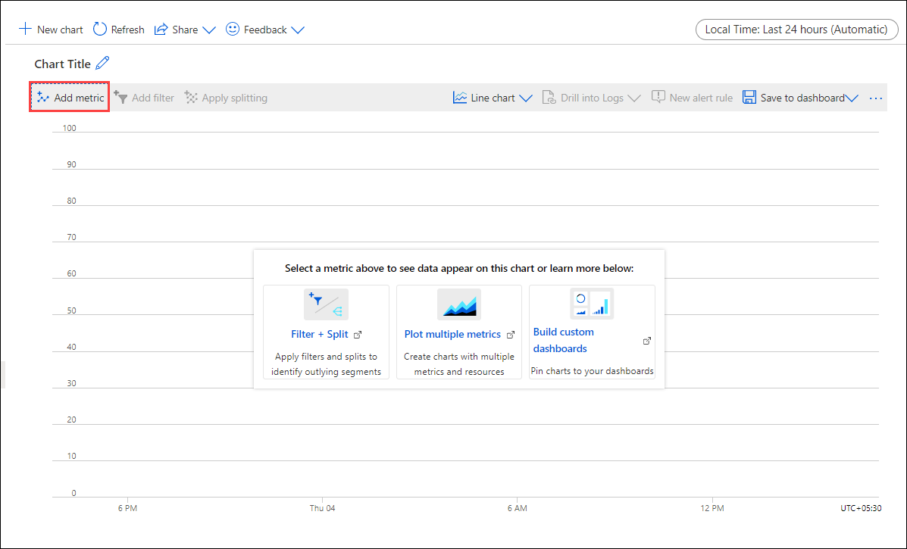
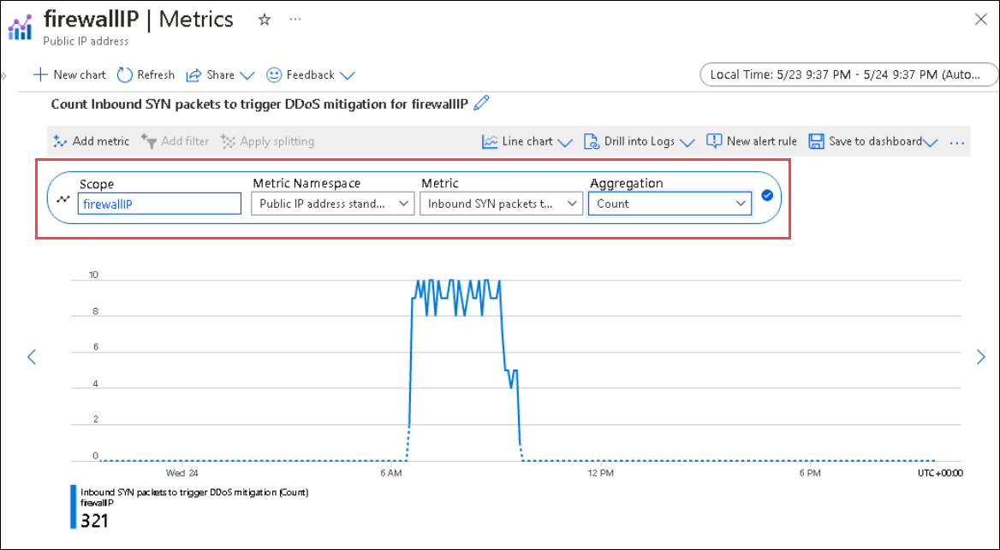
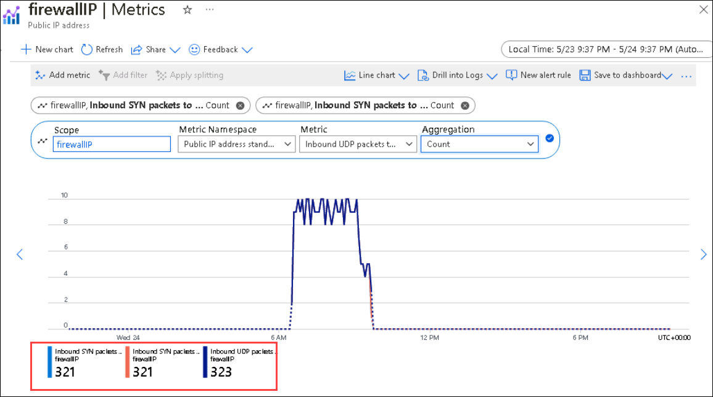

# Exercise 5: Protecting Infrastructure with Azure DDoS Protection Plans

### Estimated Duration: 60 minutes

## Overview

### What is DDoS protection?

Distributed denial of service (DDoS) attacks are some of the largest availability and security concerns facing customers who are moving their applications to the cloud. A DDoS attack attempts to exhaust an application's resources, making the application unavailable to legitimate users. DDoS attacks can be targeted at any endpoint that is publicly reachable through the internet.

Azure DDoS Protection, combined with application design best practices, provides enhanced DDoS mitigation features to defend against DDoS attacks. It's automatically tuned to help protect your specific Azure resources in a virtual network. Protection is simple to enable on any new or existing virtual network, and it requires no application or resource changes.

  

### Types of attacks Azure DDoS Protection mitigates

- **Volumetric attacks**: These attacks flood the network layer with a substantial amount of seemingly legitimate traffic. They include UDP floods, amplification floods, and other spoofed-packet floods. DDoS Protection mitigates these potential multi-gigabyte attacks by absorbing and scrubbing them, with Azure's global network scale, automatically.
- **Protocol attacks**: These attacks render a target inaccessible, by exploiting a weakness in the layer 3 and layer 4 protocol stack. They include SYN flood attacks, reflection attacks, and other protocol attacks. DDoS Protection mitigates these attacks, differentiating between malicious and legitimate traffic, by interacting with the client, and blocking malicious traffic.
- **Resource (application) layer attacks**: These attacks target web application packets, to disrupt the transmission of data between hosts. They include HTTP protocol violations, SQL injection, cross-site scripting, and other layer 7 attacks. Use a Web Application Firewall, such as the Azure Application Gateway web application firewall, as well as DDoS Protection to provide defence against these attacks. There are also third-party web application firewall offerings available in the Azure Marketplace.

## Lab Objectives

You will be able to complete the following tasks:

- Task 1: Configure Azure DDoS Network Protection
- Task 2: Configure Azure DDoS IP Protection
- Task 3: View metrics from Public IP address
  
## Task 1: Configure Azure DDoS Network Protection

In this task, you will create a DDoS protection plan to protect the virtual network.

1. In the Azure portal, search **DDoS protection plans (1)** and then select **DDoS protection plans (2)**.
 
   
 
1. Click on Create.
 
    
 
1. On the **DDoS protection** page, provide the information as mentioned below,
   - Subscription: **Leave it as default (1)**.
   - Resource Group: **JumpVM-rg (2)**.
   - Name: Enter **DDoSprotection (3)**.
   - Region: **<inject key="Region" />**
   - Click on **Next-Tags**.
 
     
 
1. On the **Tags** tab, leave everything to default and then click on **Review + create**.
 
     
  
1. If the validation is passed then click on **Create**.

    >**NOTE**: It may take a couple of minutes for the workspace to be created.

      
 
1. Once the DDoS protection is added you will see a notification that says **Deployment succeeded**, as shown below.

      
 
1. On the DDoS protection page, under setting click on **Protected resources (1)** and then select the **vnet (2)** and click on **Add (3)**.
 
      

1. On the **Add virtual network to DDoS plan** blade, provide the information as mentioned below,
    - Subscription: **Leave it as default (1)**.
    - Resource Group: **JumpVM-rg (2)**.
    - Virtual network: Select **vnet (3)**.
    - Click on **Add (4)**
   
      
 
1. Once the Protected resources are added you will see a notification that says **Successfully updated the virtual network vnet**, as shown below.
 
      
 
1. Now, In the Azure portal, search **Firewall Manager (1)** and then select **Firewall Manager (2)**.
 
      

1. Under Deployments, click on **Virtual Networks**, and you will see that you are protected.
 
      

> **Congratulations** on completing the task! Now, it's time to validate it. Here are the steps:
> - If you receive a success message, you can proceed to the next task.
> - If not, carefully read the error message and retry the step, following the instructions in the lab guide. 
> - If you need any assistance, please contact us at cloudlabs-support@spektrasystems.com. We are available 24/7 to help you out.

<validation step="d6923ba2-dfed-45e7-bedb-a5e206ea86c0" />

## Task 2: Configure Azure DDoS IP Protection

In this task, you will secure the Public IP address by using DDoS protection.

1. In the Azure portal, search **Public IP Addresses (1)** and then select **Public IP Addresses (2)**.

    

1. Select the **Firewalllp** from the list.

    

1. In the **Overview** pane, you will see **Protect IP address** on the bottom right corner, click on **Protect**.

    

1. Once you click on **Protect**, under **Protection type**, select **IP** and click on **Save**.

    

1. In the **Overview (1)** pane, select the **Properties (2)** tab, under **DDoS protection (3)** you will see that your public IP address is protected by **IP protection** as shown below.

    
    
## Task 3: View metrics from Public IP address

In this task, you will explore and visualize the metrics using various kinds of aggregation.

1. Navigate back to the **Firewalllp** page, Under Monitoring, select **Metrics**.

    

1. Select **Add metric** then select **Scope**.

    

1. Once you click on Scope, select **Public IP Address (1)** from **Resources type** then select the specific public IP address you want to log metrics for, and then select **Apply (3)**.

     

1. Under **Metric** select **Inbound SYN packets to trigger DDoS mitigation** then under **Aggregation** select type as **Count**.
  
     

1. Follow the above step to add **Inbound TCP packets to trigger DDoS mitigation** and **Inbound UDP packets to trigger DDoS mitigation**. 

      
      
      
## Summary
 
In this lab you have covered the following:
  
- Configured Azure DDoS Network Protection
- Configured Azure DDoS IP Protection
- Visualized the metrics using a Public IP address

### You have successfully completed the lab. Click on **Next >>** to proceed with next exercise.    
      