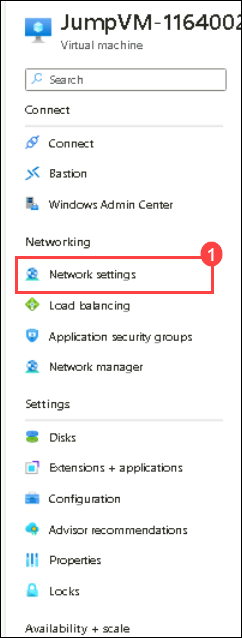
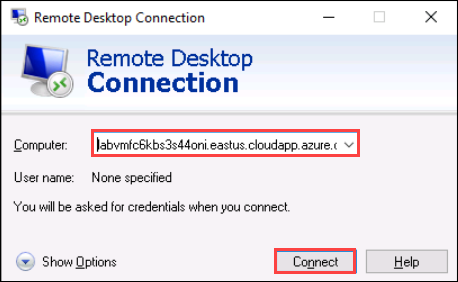
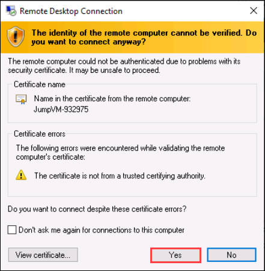
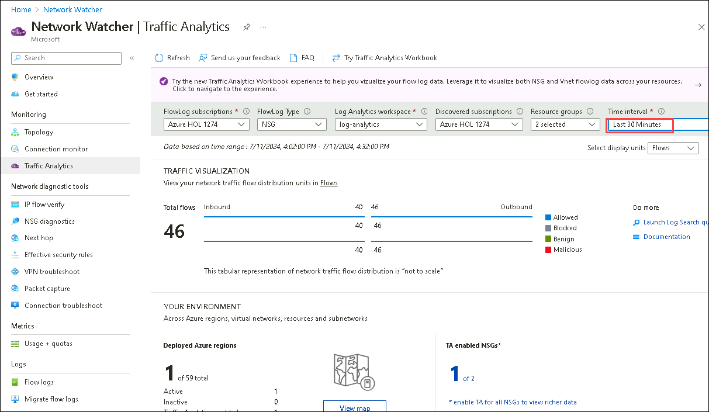
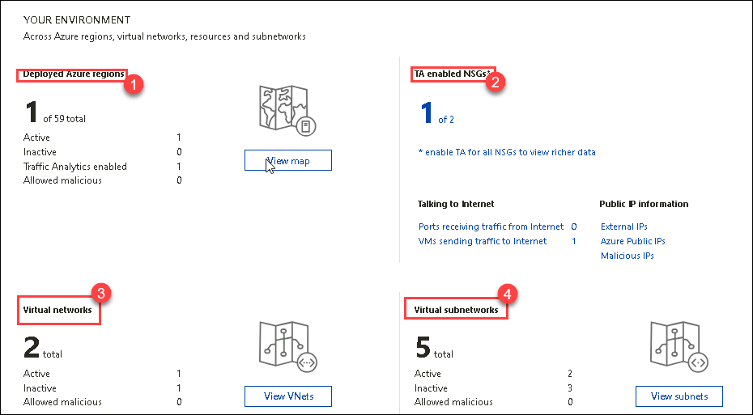

# Lab 05: Network Management and Monitoring Revisited: Flow Logs and Traffic Analytics

### Estimated Duration: 30 minutes

## Overview:

Network management and monitoring play a crucial role in maintaining a secure and efficient network infrastructure. In addition to traditional monitoring methods, **Flow logs** and **Traffic analytics** provide valuable insights into network traffic patterns and behavior.

**Flow logs** capture detailed information about network flows, including source and destination IP addresses, ports, protocols, and packet counts. They offer visibility into network traffic at the packet level, aiding in troubleshooting, detecting anomalies, and understanding network behavior.

Combining flow logs and traffic analytics enables network administrators to gain comprehensive visibility, streamline troubleshooting, and make data-driven decisions for network optimization and security enhancement.

## Lab Objectives

You will be able to complete the following tasks:

- Task 1: NSG Validation
- Task 2: Network Watcher Traffic Analytics to monitor the network
  
## Task 1: NSG Validation (Optional)

In this task, you'll access the virtual machine by configuring an inbound port rule in the network security group.

1. Navigate to the Azure portal. Using the search bar, search for **Virtual machines (1)** and **select (2)** from the suggestions.

   
   
1. Select the **JumpVM-<inject key="DeploymentID" enableCopy="false" />** from the list.

   
 
1. From the sidebar, select **Networking** from Settings.

   

1. On the Networking page, Click on **default-allow-rdp (1)** inbound port rule to edit the configuration, select **Deny (2)** from Action and click on **Save (3)**.

   
   
1. On the JumpBox VM, in the search bar, **Search** for **RDP** and **select** the **Remote Desktop Connection** app.
   
   

1. Paste the **JumpVM DNS Name** in the **Computer** field and click on **Connect**.
   * **JumpVM DNS Name**: **<inject key="JumpVM DNS Name" />**

          
 
1. You will see the error **Remote desktop can't be connected to the remote computer** because we are denied the inbound rule for disallowing the RDP and clicking on **OK**.

   
   
1. Navigate back to the **JumpVM-<inject key="DeploymentID" enableCopy="false" />**, Open Networking tab and click on **default-allow-rdp (1)** inbound port rule to edit the configuration, select **Allow (2)** from Action and click on **Save (3)**.

   

1. Navigate back on **Remote Desktop Connection**, click on **Connect** and you will see that you are able to connect to the VM.

1. Now, enter the JUMPVM **username**, and **password** provided below and then click on the **OK** button.
    - **Username**: **<inject key="JumpVM Admin Username" />**
    - **Password**: **<inject key="JumpVM Admin Password" />**
   
        
   
1. Next, click on the **Yes** button to accept the certificate and add in trusted certificates.

   

## Task 2: Network Watcher Traffic Analytics to monitor the network

In this task, you will enable the Traffic Analytics in the NSG flow logs and review the logs.
 
1. Navigate to the Azure portal. Using the search bar, search for **Application gateways (1)** and **select (2)** from the suggestions..
 
     
 
 1. Select your **Application Gateway**.
 
     
 
 1. Select the **Frontend public IP address** of the application gateway.
 
     
  
 1. Copy the **Public IP address** and save it to Notepad for later use.

     

 1. To test the application copy and paste the Frontend public IP address of **Application Gateway** in a new browser tab and generate some traffic by refreshing the browser.
 
      > **Note**: You will see that your website is running.
 
      

1. Navigate to the resource group **JumpVM-rg**, and from the **Overview (1)** tab select the Firewall.

   
   
1. Select **Firewall Public IP** from the Overview tab.

    
    
1. Copy the Public Ip and save it in a text editor.

    
      
1. Navigate to the Firewall's public IP address and generate some traffic by refreshing the browser.

   

1. Navigate back to the Network Watcher and select **Traffic Analytics**, under **Monitoring** from the options on the left side of the Network Watcher blade.

   

      
1. On the **Traffic Analytics** page, set the time interval to the **Last 30 minutes**.

   
   
   > **Note: If you observe the Time interval is greyed out, click on Meanwhile, click here to see just resource data and perform the above step**.
   >
   > **It may take upto 30 to 60 minutes to click on Meanwhile, click here to see just resource data and perform the above step option to come up**.

      
      
1. Now, you can observe the total number of network traffic flows from **Traffic Visualization**.

    

    > **Note: The dashboard may take up to 60-90 minutes to appear when deployed for the first time. This is because Traffic Analytics must first aggregate enough data for it to derive meaningful insights. If it takes more time, you can perform the next task and come back later and check on this**.
           
     
1. Under **Traffic Analytics** Scroll down to **Your Environment** to view the total number of **Deployed Azure regions (1)**, **TA Enabled NSGs (2)**, **Virtual networks (3)**, and **Virtual subnetworks (4)**.

    
      
1. To visualize the traffic distribution by geography, click on **View map**. The geo-map shows the traffic distribution to a data center from countries/regions and continents communicating with it.

    
     
1. In the **Traffic Analytics Geo Map View** page, click on the **Green** icon which indicates the Azure region, and observe the resources deployed under the region, to explore more select **More details**.

    
      
1. Under the **More Insights** blade, scroll down and explore traffic distribution for deployments of the East US region.

    
     
1. To close the **Traffic Analytics Geo Map View**, click on the cross at the top right corner.

     
      
1. Close the **Ports receiving traffic from the Internet** page by clicking the **Cross (X) icon** from the top right corner.
      
1. Under the Traffic Analytics page, scroll down to **Traffic Distribution** to view the analytics of traffic flows across the host, subnet, VNet, and VMSS.

    
     
1. To view the analytics of traffic flows across the host, select **IP (1)**, then select **See all (2)** from **Traffic Distribution**.

    
    
1. You can observe the graph of the **Time trending chart for the top 5 talking IPs** from the **Traffic distribution across the top IPs** page.

    
    
1. Under **Details of top 5 talking IPs**, select VM IP to explore more about traffic distribution.

     
     
1. Close the **Traffic distribution across top IPs** by clicking the **cross (X) icon** at the top-left corner of the page.
    
1. In the same way, you can explore more about **Malicious traffic**, and **Blocked traffic** 

1. Now scroll down to **Application ports**, to view analytics for application ports utilized across your environment and select **See all**.

    
     
1. From the **Most frequent L7 protocols** page, you can explore more about the ports and their ranging.

    

## Summary
 
In this lab you have covered the following:
  
- Performed NSG validation.
- Monitored the network watcher traffic.

### You have successfully completed the lab

