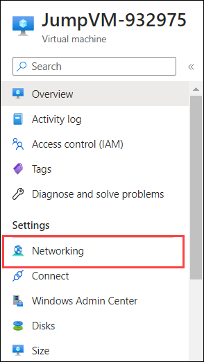
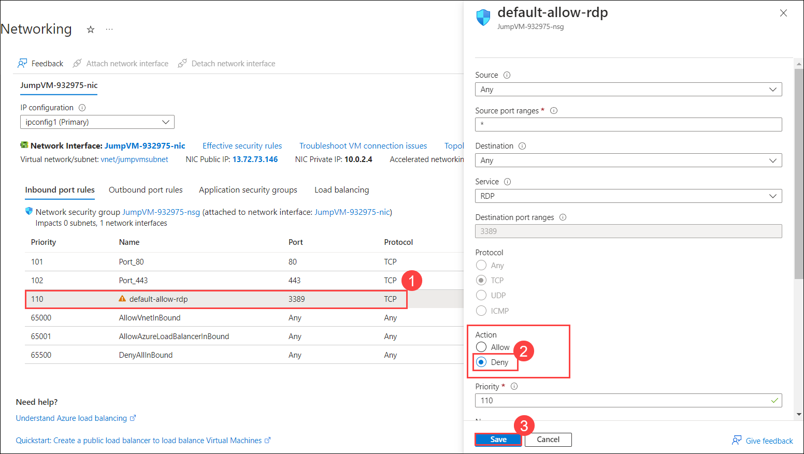
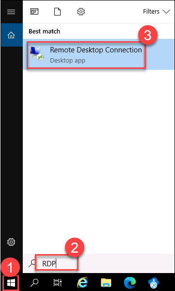
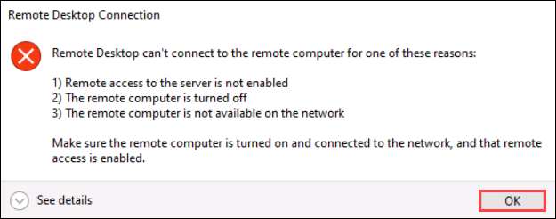
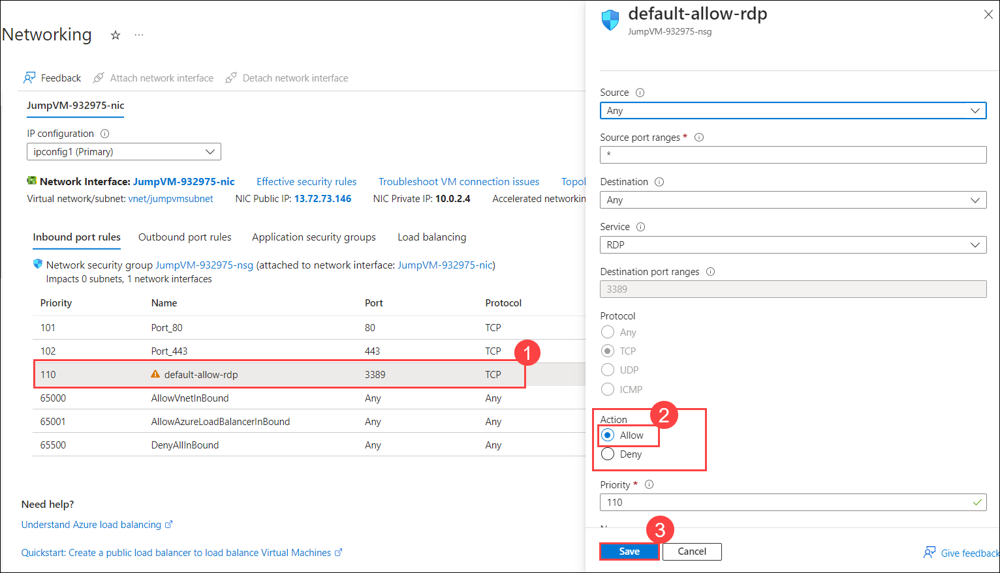

# Exercise 5- Network Management and Monitoring Revisited: Flow Logs and Traffic Analytics

1. Navigate to Azure portal. Using the search bar, search for **Virtual machines (1)** and **select (2)** it from the suggestions.

   
   
1. Select the **JumpVM-<inject key="DeploymentID" enableCopy="false" />** from the list.

   
 
1. From the sidebar, select **Networking** from Settings.

   

1. On the Networking page, Click on **default-allow-rdp (1)** inbound port rule to edit the configuration, select **Deny (2)** from Action and click on **Save (3)**.

   
   
1. On the JumpBox VM, in the search bar, **Search** for **RDP** and **select** the **Remote Desktop Connection** app.
   
   

1. Paste the **JumpVM DNS Name** in the **Computer** field and click on **Connect**.
   * **JumpVM DNS Name**: **<inject key="JumpVM DNS Name" />**

     
 
1. you will see the error **Remote destop can't connected to the remote computer** because we are deny the inbound rule for diallow the RDP and click on **OK**.

   
   
1. Navigate back to the **JumpVM-<inject key="DeploymentID" enableCopy="false" />**, Open Networking tab and click on **default-allow-rdp (1)** inbound port rule to edit the configuration, select **Allow (2)** from Action and click on **Save (3)**.

   

1. Navigate back on **Remote Desktop Connection**, click on **Connect** and you will see that you are able to connect to the VM.

1. Now, enter the JUMPVM **username**, and **password** provided below and then click on the **OK** button.
    - **Username**: **<inject key="JumpVM Admin Username" />**
    - **Password**: **<inject key="JumpVM Admin Password" />**
   
   
   
1. Next, click on the **Yes** button to accept the certificate and add in trusted certificates.

   

